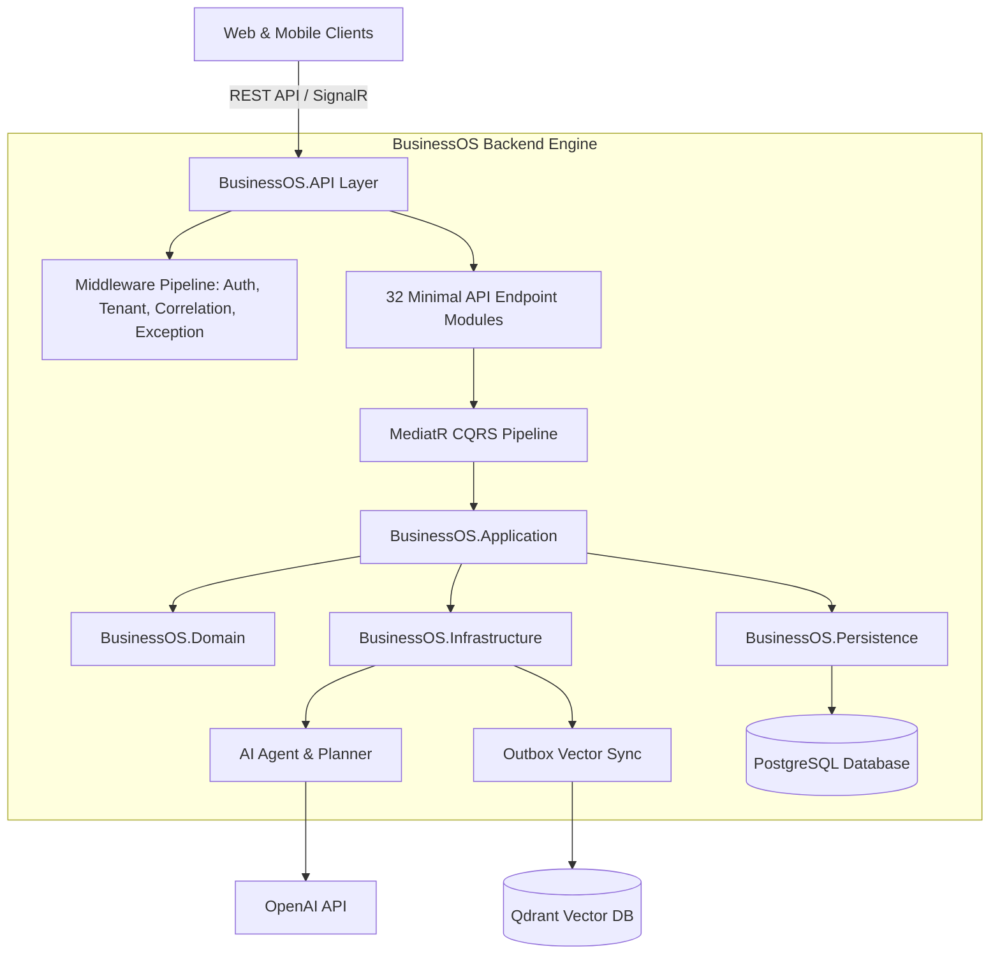

# BusinessOS - Enterprise Multi-Tenant Business Operating System

BusinessOS is a modern, enterprise-grade business management platform built on **.NET 10 Web API**, **Clean Architecture**, **CQRS with MediatR**, **PostgreSQL (EF Core 10)**, **Qdrant Vector Database**, and an **Autonomous AI Agent & RAG Framework**.

It provides freelancers, startups, agencies, and enterprises with a unified platform for multi-tenant workspace management, customer CRM, invoicing, procurement, inventory tracking, financial analytics, and AI copilot execution.

---

## 🏛 System Architecture Overview

BusinessOS follows **Clean Architecture** and **Domain-Driven Design (DDD)** principles to separate concerns into decoupled layers:



---

## 📚 Technical Documentation Index (`/docs`)

Comprehensive documentation is available inside the [`/docs`](file:///d:/Business_OS/BusinessOS/docs/README.md) directory:

| Section | Topic | Documentation Link |
| :--- | :--- | :--- |
| 📍 **Portal** | Documentation Index & Overview | [docs/README.md](file:///d:/Business_OS/BusinessOS/docs/README.md) |
| 🏗 **Architecture** | Clean Architecture & Layering Principles | [docs/Architecture.md](file:///d:/Business_OS/BusinessOS/docs/Architecture.md) |
| 📁 **Structure** | Folder & Directory Guide | [docs/Folder-Structure.md](file:///d:/Business_OS/BusinessOS/docs/Folder-Structure.md) |
| 🔄 **Lifecycle** | End-to-End Request Execution Trace | [docs/Request-Lifecycle.md](file:///d:/Business_OS/BusinessOS/docs/Request-Lifecycle.md) |
| 🔑 **Authentication**| ASP.NET Core Identity & JWT Tokens | [docs/Authentication.md](file:///d:/Business_OS/BusinessOS/docs/Authentication.md) |
| 🛡 **Authorization** | Dynamic RBAC & Permission Policies | [docs/Authorization.md](file:///d:/Business_OS/BusinessOS/docs/Authorization.md) |
| 🔌 **DI Container** | IoC Lifetimes & Extension Methods | [docs/Dependency-Injection.md](file:///d:/Business_OS/BusinessOS/docs/Dependency-Injection.md) |
| ⚙️ **Middleware** | Pipeline Execution Order & Handlers | [docs/Middleware.md](file:///d:/Business_OS/BusinessOS/docs/Middleware.md) |
| ⚡️ **CQRS** | MediatR Commands, Queries & Behaviors | [docs/CQRS.md](file:///d:/Business_OS/BusinessOS/docs/CQRS.md) |
| 🤖 **AI Agent** | Autonomous Planning & Tool Invocation | [docs/AI-Agent.md](file:///d:/Business_OS/BusinessOS/docs/AI-Agent.md) |
| 🔍 **RAG Engine** | Retrieval-Augmented Generation | [docs/RAG.md](file:///d:/Business_OS/BusinessOS/docs/RAG.md) |
| 📝 **Prompts** | Dynamic Prompt Pipeline & Grounding | [docs/Prompt-Pipeline.md](file:///d:/Business_OS/BusinessOS/docs/Prompt-Pipeline.md) |
| 📊 **Vector DB** | Qdrant Vector Store & Outbox Worker | [docs/Vector-Search.md](file:///d:/Business_OS/BusinessOS/docs/Vector-Search.md) |
| 🗄 **Database** | EF Core 10, Multi-Tenancy & Filters | [docs/Database.md](file:///d:/Business_OS/BusinessOS/docs/Database.md) |
| 🔗 **ERD Schema** | Entity Dictionary & Mermaid ERDs | [docs/Entity-Relationships.md](file:///d:/Business_OS/BusinessOS/docs/Entity-Relationships.md) |
| 🛠 **Services** | Core Infrastructure & App Services Index | [docs/Services.md](file:///d:/Business_OS/BusinessOS/docs/Services.md) |
| 📡 **API Routes** | Minimal Endpoints Route Matrix | [docs/Controllers.md](file:///d:/Business_OS/BusinessOS/docs/Controllers.md) |
| 🔀 **API Flows** | End-to-End Sequence Diagrams | [docs/API-Flow.md](file:///d:/Business_OS/BusinessOS/docs/API-Flow.md) |
| ⚙️ **Settings** | Configuration Matrix (`appsettings.json`) | [docs/Configuration.md](file:///d:/Business_OS/BusinessOS/docs/Configuration.md) |
| 📜 **Logging** | Serilog Structured Logs & Audit Trails | [docs/Logging.md](file:///d:/Business_OS/BusinessOS/docs/Logging.md) |
| ⚠️ **Errors** | RFC 7807 ProblemDetails Error Pipeline | [docs/Error-Handling.md](file:///d:/Business_OS/BusinessOS/docs/Error-Handling.md) |
| 🐳 **DevOps** | Docker Compose & Production Deployment | [docs/Deployment.md](file:///d:/Business_OS/BusinessOS/docs/Deployment.md) |
| 💼 **Workflows** | Domain Business Process Flows | [docs/Workflows.md](file:///d:/Business_OS/BusinessOS/docs/Workflows.md) |

---

## 🛠 Tech Stack

* **Framework**: .NET 10 SDK Web API
* **Architecture**: Clean Architecture, Domain-Driven Design, CQRS with MediatR
* **Persistence**: Entity Framework Core 10, PostgreSQL (`Npgsql`)
* **Vector Search**: Qdrant Vector Database (`Qdrant.Client`)
* **AI Framework**: OpenAI API (`gpt-4o`, `text-embedding-3-small`), Heuristic & LLM Tool Agent
* **Speech Synthesis**: Microsoft Edge Neural TTS (`EdgeNeuralTtsService`)
* **Realtime Communications**: ASP.NET Core SignalR
* **Security & Auth**: ASP.NET Core Identity, JWT Bearer Token Signing, Dynamic Permission Policies
* **Payment Gateways**: Stripe, JazzCash, EasyPaisa
* **Document Generation**: QuestPDF & HTML/CSS rendering
* **Logging**: Serilog (Console, Rolling File Sinks, Context Enrichers)
* **DevOps**: Docker, Docker Compose, EF Core CLI Migrations

---

## ⚡ Quick Start Guide

### Prerequisites
* [.NET 10 SDK](https://dotnet.microsoft.com/download)
* [Docker Desktop](https://www.docker.com/products/docker-desktop/)

### 1. Clone & Set Up Local Infrastructure
```bash
# Start PostgreSQL & Qdrant containers
docker-compose up -d
```

### 2. Apply Database Migrations
```bash
dotnet ef database update --project BusinessOS.Infrastructure --startup-project BusinessOS.API
```

### 3. Run the Backend API
```bash
dotnet run --project BusinessOS.API
```

The Web API will launch at `https://localhost:7197` (or configured HTTP/HTTPS ports). OpenAPI / Swagger UI will be available at `/swagger`.

---

## 🌐 Environment Variables Matrix

| Variable | Description | Default |
| :--- | :--- | :--- |
| `ConnectionStrings__DefaultConnection` | Database Connection String | PostgreSQL localhost connection |
| `Jwt__Key` | JWT HMAC-SHA256 Secret Key | Min 32 character key |
| `Ai__OpenAiApiKey` | OpenAI Secret API Key | `sk-proj-...` |
| `Qdrant__Host` | Qdrant DB Host Address | `localhost` |
| `Qdrant__Port` | Qdrant gRPC Port | `6334` |

---

## 📄 License
This project is released under the standard repository license. See [LICENSE.txt](file:///d:/Business_OS/BusinessOS/LICENSE.txt) for details.
