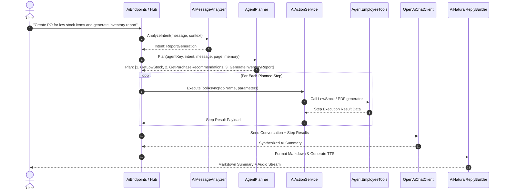

# AI Agent Framework Guide: BusinessOS Backend

## Purpose
This document provides a comprehensive analysis of the Autonomous AI Agent Framework inside BusinessOS, detailing intent recognition, multi-step workflow planning, tool selection, memory retention, neural voice synthesis, and OpenAI LLM execution.

---

## Responsibilities
* Analyze incoming user natural language requests for intent and page context.
* Determine if a single-turn reply or multi-step autonomous workflow is required (`AgentPlanner.RequiresWorkflow`).
* Select and execute registered domain tools (`AiToolName` - e.g. `CreateInvoice`, `GetLowStock`, `GenerateInventoryReport`, `CreateSale`, `GetPurchaseRecommendations`).
* Maintain conversational memory (`AiMemoryStateDto`) and user page context (`AiPageContextDto`).
* Synthesize natural voice audio responses using Edge Neural TTS (`EdgeNeuralTtsService`).
* Embellish responses using `AiNaturalReplyBuilder`.

---

## How It Works
The AI Agent framework operates as an autonomous agentic system embedded within `BusinessOS.Infrastructure/AI`:

1. **Intent Analysis**: `AiMessageAnalyzer` evaluates user prompts against page context to identify intents (`ReportGeneration`, `Workflow`, `Onboarding`, `DirectAction`, `GeneralQnA`).
2. **Workflow Planning**: `AgentPlanner` evaluates if multi-step orchestration is required. If true, it returns an `AgentWorkflowPlanDto` containing sequenced execution steps.
3. **Tool Invocation**: `AiActionService` maps tools (`AgentBusinessTools`, `AgentEmployeeTools`) to EF Core domain commands/queries.
4. **Context Enrichment**: `AiContextService` gathers relevant RAG documents, entity statistics, and conversation history.
5. **LLM Completion**: `OpenAiChatClient` / `CursorLlmChatClient` formats system prompts and tool results into an OpenAI API payload.
6. **Natural Reply & Voice**: `AiNaturalReplyBuilder` formats final markdown outputs while `EdgeNeuralTtsService` generates audio streams for voice playback.

```mermaid
graph TD
    User Prompt --> Analyzer[AiMessageAnalyzer: Detect Intent]
    Analyzer --> Planner[AgentPlanner: Requires Workflow?]

    alt Single-Turn Interaction
        Planner -->|No| PromptBuilder[AiPromptBuilder & AiContextService]
        PromptBuilder --> LLM[OpenAiChatClient]
        LLM --> ReplyBuilder[AiNaturalReplyBuilder]
    else Multi-Step Autonomous Workflow
        Planner -->|Yes| Plan[Generate AgentWorkflowPlanDto]
        Plan --> ExecutionLoop[Execute Step Tool via AiActionService]
        ExecutionLoop --> Tools[AgentBusinessTools / EmployeeTools]
        Tools --> EntityMutation[EF Core / DbContext Action]
        EntityMutation --> ExecutionLoop
        ExecutionLoop --> StepSummary[Collect All Step Results]
        StepSummary --> LLM
    end

    ReplyBuilder --> Response[Final Response + Neural TTS Audio]
```

---

## Execution Flow



---

## Registered Agent Personas (`AgentKeys`)
* **`sales_agent`**: Customer relationship, quotations, invoice generation, and order closing.
* **`inventory_agent`**: Stock level tracking, low-stock alerts, warehouse reordering, and PO generation.
* **`finance_agent`**: Expense analysis, profit & loss summary, tax metrics, and billing reports.
* **`onboarding_agent`**: Guided multi-step tenant setup and company configuration.

---

## Agent Business Tools (`AiToolName`)
* `CreateCustomer`: Adds new customer records.
* `CreateInvoice`: Generates formal customer invoices.
* `CreateSale`: Records completed sales transactions.
* `GetInventorySummary`: Fetches real-time stock levels.
* `GetLowStock`: Filters inventory items below safety thresholds.
* `GetPurchaseRecommendations`: Calculates AI-driven restock quantities.
* `GenerateInventoryReport`: Compiles PDF inventory intelligence reports.

---

## Dependencies
* **OpenAI SDK**: API integration for completions.
* **EdgeNeuralTtsService**: Neural voice generation.
* **QuestPDF / HTML-to-PDF**: Report rendering.
* **ApplicationDbContext**: Entity queries and mutations.

---

## Used By
* `AiEndpoints.cs`: Exposed via `/api/ai/chat`, `/api/ai/agent/execute`.
* `AgentHub.cs`: SignalR websocket hub for real-time streaming agent steps.

---

## Calls To
* `OpenAiChatClient.CompleteAsync()`
* `AgentBusinessTools.ExecuteAsync()`
* `QdrantVectorStore.SearchAsync()`

---

## Important Classes
* `AgentPlanner`: Heuristic and intent-based multi-step workflow planner.
* `AiActionService`: Tool executor mapping tool names to domain services.
* `AiChatService`: Primary orchestrator for chat sessions.
* `AiNaturalReplyBuilder`: Formats Markdown responses with emojis, bullet points, and voice cues.
* `EdgeNeuralTtsService`: Converts text responses to MP3 audio via Microsoft Edge TTS API.

---

## Important Interfaces
* `IAgentPlanner`: Workflow plan creation contract.
* `ILlmChatClient`: LLM abstraction contract.
* `IAiChatService`: High-level chat service contract.

---

## Important Methods
* `AgentPlanner.RequiresWorkflow()`: Evaluates string matching and intent flags.
* `AgentPlanner.Plan()`: Assembles step sequences.
* `AiActionService.ExecuteActionAsync()`: Invokes tool functions.

---

## Configuration
Controlled via `appsettings.json`:
```json
{
  "Ai": {
    "OpenAiApiKey": "sk-proj-...",
    "DefaultModel": "gpt-4o",
    "Temperature": 0.3,
    "MaxTokens": 2000
  }
}
```

---

## Common Pitfalls
* **Infinite Tool Loops**: Ensuring tool executions set strict step caps (max 10 steps per workflow plan) prevents recursive execution.
* **Model Selection**: Using high-temperature settings (> 0.7) for financial or inventory tool parameters can lead to invalid JSON parsing errors; keep temperature at <= 0.3 for tool execution.

---

## Future Improvements
* Add function-calling via native OpenAI JSON Schema function definitions alongside heuristic planning.

---

## Related Documents
* [RAG.md](file:///d:/Business_OS/BusinessOS/docs/RAG.md)
* [Prompt-Pipeline.md](file:///d:/Business_OS/BusinessOS/docs/Prompt-Pipeline.md)
* [Vector-Search.md](file:///d:/Business_OS/BusinessOS/docs/Vector-Search.md)
