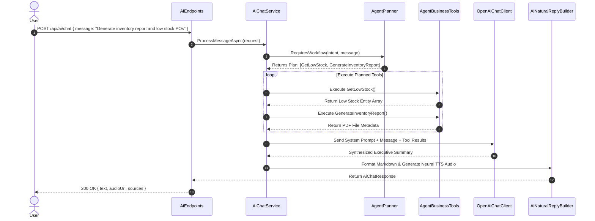
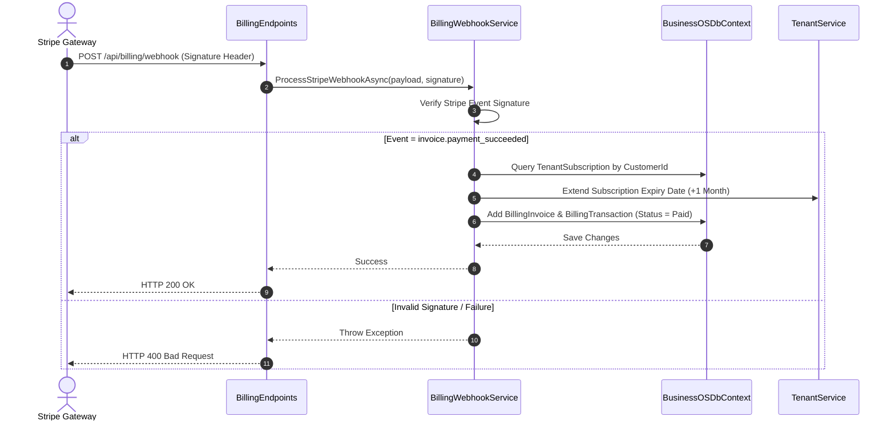

# API Interaction Flowcharts Guide: BusinessOS Backend

## Purpose
This document provides end-to-end visual sequence diagrams and flowcharts for primary API operations across BusinessOS, including Invoice Creation & PDF Generation, AI Assistant Multi-Tool Execution, and Stripe Payment Webhook Processing.

---

## 1. Invoice Creation & Vector Ingestion Flow

```mermaid
sequenceDiagram
    autonumber
    actor Client
    participant API as InvoiceEndpoints
    participant Med as MediatR Pipeline
    participant Hand as CreateInvoiceCommandHandler
    participant DB as BusinessOSDbContext (PostgreSQL)
    participant Interceptor as VectorSyncOutboxInterceptor
    participant Worker as VectorSyncBackgroundService
    participant Qdrant as QdrantVectorStore

    Client->>API: POST /api/invoices { customerId, items: [...] }
    API->>Med: Send(CreateInvoiceCommand)
    Med->>Med: Validate via FluentValidation
    Med->>Hand: Handle(CreateInvoiceCommand)
    Hand->>DB: Add Invoice Entity & SaveChangesAsync()
    DB->>Interceptor: Intercept SaveChanges
    Interceptor->>DB: Write VectorSyncOutboxMessage
    DB-->>Hand: Commit Transaction
    Hand-->>API: Result<InvoiceDto>.Success()
    API-->>Client: 201 Created { id: "inv_123" }

    async Background Vector Ingestion
        Worker->>DB: Poll Pending Outbox Messages
        Worker->>Worker: Project Invoice to Text String
        Worker->>Qdrant: Upsert Vector Point (TenantId, Text, Embeddings)
        Worker->>DB: Mark Outbox Status = Processed
    end
```

---

## 2. AI Copilot Chat & Tool Calling Flow



---

## 3. Stripe Payment Webhook Processing Flow



---

## Related Documents
* [Controllers.md](file:///d:/Business_OS/BusinessOS/docs/Controllers.md)
* [Request-Lifecycle.md](file:///d:/Business_OS/BusinessOS/docs/Request-Lifecycle.md)
* [AI-Agent.md](file:///d:/Business_OS/BusinessOS/docs/AI-Agent.md)
