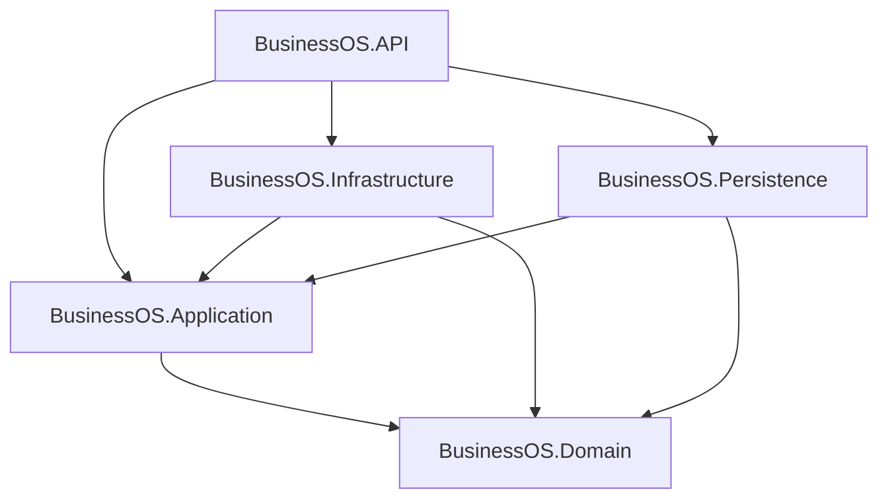
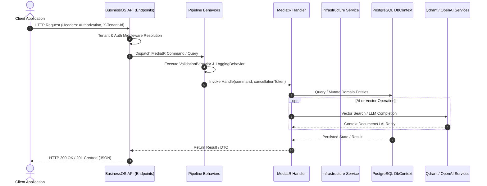

# Architecture Guide: BusinessOS Backend

## Purpose
This document provides an in-depth architectural breakdown of the BusinessOS backend. It explains the high-level system design, Clean Architecture layer separation, Domain-Driven Design (DDD) principles, CQRS patterns, multi-tenancy model, and asynchronous vector processing design.

---

## Responsibilities
* Enforce strict dependency boundaries using Clean Architecture principles.
* Isolate business rules within `BusinessOS.Domain` from infrastructure or framework concerns.
* Encapsulate application use-cases inside `BusinessOS.Application` using MediatR Commands and Queries.
* Provide robust persistence, AI, vector search, and external payment integrations inside `BusinessOS.Infrastructure` and `BusinessOS.Persistence`.
* Expose secure, validated, multi-tenant HTTP minimal endpoints via `BusinessOS.API`.

---

## How It Works
BusinessOS is structured around 5 core projects:

1. **`BusinessOS.Domain`**: Core domain model containing entities, value objects, domain enums, and base interfaces (`AuditableEntity`, `ISoftDelete`). It has **zero dependencies** on external frameworks.
2. **`BusinessOS.Application`**: Application business logic orchestrated by MediatR handlers, FluentValidation rules, pipeline behaviors, and DTO definitions. Depends only on `BusinessOS.Domain`.
3. **`BusinessOS.Infrastructure`**: Concrete implementations of application interfaces including AI services (`OpenAiChatClient`), Vector DB (`QdrantVectorStore`), payment gateways, email, identity (`JwtTokenGenerator`), and background services.
4. **`BusinessOS.Persistence`**: Entity Framework Core database context (`ApplicationDbContext`), PostgreSQL entity configurations, audit logging, soft delete interceptors, and EF migrations.
5. **`BusinessOS.API`**: ASP.NET Core 10 web application containing middleware, minimal API endpoint maps, SignalR hubs, OpenAPI configuration, and IoC bootstrapping.

---

## Execution Flow

### System Boundary Execution Flow

---

## Dependencies
* **.NET 10 Runtime**: Next-generation web performance.
* **MediatR**: In-process messaging for CQRS.
* **FluentValidation**: Request model validation.
* **Entity Framework Core 10 & Npgsql**: Relational database ORM with PostgreSQL.
* **Qdrant.Client**: gRPC client for Qdrant Vector Database.
* **OpenAI SDK**: Embedding and Chat Completions API.
* **Serilog**: Structured logging provider.

---

## Used By
* Frontend Single Page Applications (SPAs)
* Mobile Applications
* Background Worker Processes & Scheduled Webhooks

---

## Calls To
* PostgreSQL Database Server
* Qdrant Vector DB Instance
* OpenAI REST API Endpoints
* Stripe, JazzCash, & EasyPaisa Payment Webhooks / Gateways

---

## Important Classes
* `Program.cs` (`BusinessOS.API`): Application host entry point and middleware pipeline composer.
* `ApplicationDbContext` (`BusinessOS.Persistence`): Core EF Core DbContext managing entity sets and tenant query filters.
* `TenantContextService` (`BusinessOS.Infrastructure`): Holds request-scoped tenant state (`ITenantContext`).
* `AiChatService` (`BusinessOS.Infrastructure`): High-level service orchestrating chat, prompt assembly, and RAG context.
* `AgentPlanner` (`BusinessOS.Infrastructure`): Autonomous tool selector and multi-step plan generator.

---

## Important Interfaces
* `ITenantContext`: Provides tenant ID, name, status, and tenant resolution scope.
* `ICurrentUserService`: Exposes current authenticated user claims (`UserId`, `Email`, `Roles`, `Permissions`).
* `ILlmChatClient`: Abstraction over LLM completions (OpenAI, Cursor router).
* `IVectorStore`: Abstraction over vector database operations (upsert, similarity search, delete).
* `IAgentPlanner`: Agent execution planning contract.

---

## Important Methods
* `Program.Main / WebApplication.Run()`: Bootstraps services and maps endpoints.
* `ApplicationDbContext.OnModelCreating()`: Configures global query filters for multi-tenancy (`TenantId`) and soft delete (`IsDeleted`).
* `QdrantVectorStore.SearchAsync()`: Executes vector similarity queries against collection indices.
* `LlmChatClientRouter.GetClient()`: Resolves active LLM model provider.

---

## Configuration
Architectural settings are populated via `appsettings.json` and environment variables bound to strong option classes:
* `JwtOptions`: `SecretKey`, `Issuer`, `Audience`, `ExpiryMinutes`.
* `AiOptions`: `OpenAiApiKey`, `DefaultModel`, `Temperature`, `MaxTokens`.
* `QdrantOptions`: `Host`, `Port`, `ApiKey`, `CollectionName`.

---

## Common Pitfalls
* **Direct DbContext Usage in API Endpoints**: Endpoints should dispatch MediatR requests rather than executing DbContext calls directly to preserve CQRS boundaries.
* **Bypassing Tenant Filters**: Executing raw SQL queries (`FromSqlRaw`) bypasses EF Core global query filters unless `WHERE "TenantId" = @tenantId` is manually specified.
* **Async Deadlocks**: Avoid calling `.Result` or `.Wait()` on MediatR dispatchers or DbContext tasks.

---

## Future Improvements
* Implement Distributed Cache (Redis) for tenant feature flags and permission matrices.
* Add event-driven domain event dispatching via MassTransit / RabbitMQ for inter-service communication.

---

## Related Documents
* [Request-Lifecycle.md](file:///d:/Business_OS/BusinessOS/docs/Request-Lifecycle.md)
* [CQRS.md](file:///d:/Business_OS/BusinessOS/docs/CQRS.md)
* [Database.md](file:///d:/Business_OS/BusinessOS/docs/Database.md)
* [AI-Agent.md](file:///d:/Business_OS/BusinessOS/docs/AI-Agent.md)
