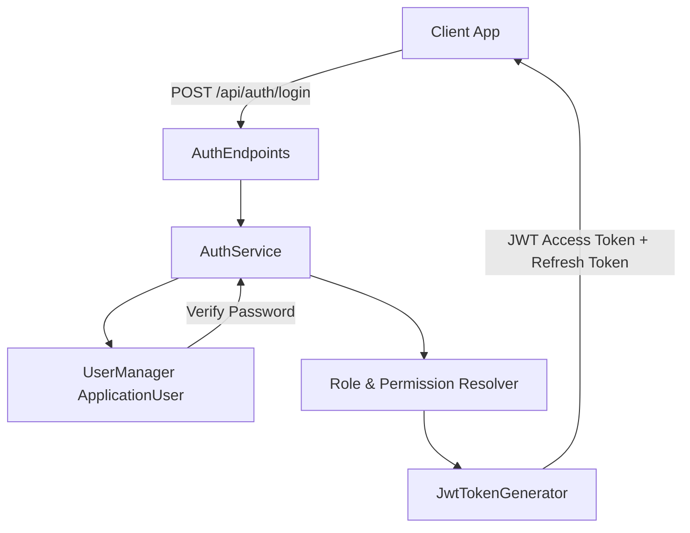
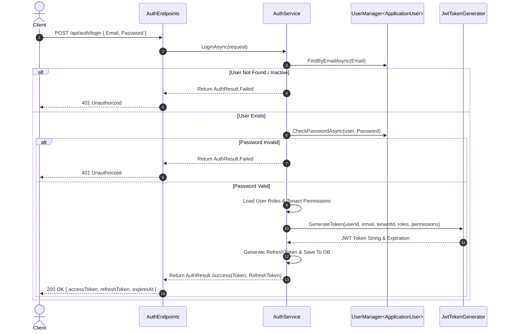

# Authentication Guide: BusinessOS Backend

## Purpose
This document explains the authentication architecture in BusinessOS, covering identity management, JWT token generation, refresh token flows, password hashing, and user claim structures.

---

## Responsibilities
* Verify user credentials during login (`AuthEndpoints`, `AuthService`).
* Provision JSON Web Tokens (JWT) containing user ID, email, tenant context, roles, and fine-grained permissions.
* Validate access tokens on every incoming HTTP API request.
* Manage refresh tokens for seamless session extension.
* Support self-service user registration, onboarding, and tenant association.

---

## How It Works
BusinessOS uses ASP.NET Core Identity backed by PostgreSQL for user credential management and `JwtTokenGenerator` (`BusinessOS.Infrastructure`) for token issuance.



---

## Execution Flow



---

## Dependencies
* **Microsoft.AspNetCore.Authentication.JwtBearer**: Validates incoming JWT tokens.
* **Microsoft.AspNetCore.Identity.EntityFrameworkCore**: Manages user tables and password hashing.
* **System.IdentityModel.Tokens.Jwt**: Constructs and serializes JWT tokens.

---

## Used By
* `AuthEndpoints.cs`: Exposes `/api/auth/login`, `/api/auth/register`, `/api/auth/refresh-token`, `/api/auth/me`.
* All API endpoints decorated with `.RequireAuthorization()`.

---

## Calls To
* `UserManager<ApplicationUser>`: User database queries and password verification.
* `IJwtTokenGenerator`: Secret key signing (`HmacSha256`).

---

## Important Classes
* `ApplicationUser`: Extends `IdentityUser`, storing `TenantId`, `FirstName`, `LastName`, `IsActive`, and audit timestamps.
* `JwtTokenGenerator`: Generates signed JWTs containing custom claim keys (`TenantId`, `Permissions`).
* `AuthService`: Application service handling authentication flows and token refreshes.

---

## Important Interfaces
* `IJwtTokenGenerator`: Contract for token construction and expiration calculations.
* `IAuthService`: High-level authentication operation contract.

---

## Important Methods
* `JwtTokenGenerator.GenerateToken()`: Encodes `ClaimTypes.NameIdentifier`, `ClaimTypes.Email`, `TenantId`, `ClaimTypes.Role`, and comma-separated `Permissions` string into JWT claims.
* `AuthService.RefreshTokenAsync()`: Validates refresh token eligibility and issues new token pairs.

---

## Configuration
JWT settings are configured via `appsettings.json` under the `Jwt` section:
```json
{
  "Jwt": {
    "Key": "YOUR_SUPER_SECRET_HMAC_SHA256_KEY_MIN_32_BYTES",
    "Issuer": "BusinessOS",
    "Audience": "BusinessOS.Client",
    "ExpiryMinutes": "60"
  }
}
```

---

## Common Pitfalls
* **Expired Token Resolution**: Clients must catch `401 Unauthorized` responses and initiate `/api/auth/refresh-token` before retrying failed requests.
* **Missing Key in Production**: Using a weak key (< 256 bits) will cause JWT library startup exceptions in production.

---

## Future Improvements
* Add Multi-Factor Authentication (MFA / TOTP) via Authenticator Apps.
* Add OAuth2 / OpenID Connect Social Logins (Google, Microsoft 365).

---

## Related Documents
* [Authorization.md](file:///d:/Business_OS/BusinessOS/docs/Authorization.md)
* [Configuration.md](file:///d:/Business_OS/BusinessOS/docs/Configuration.md)
