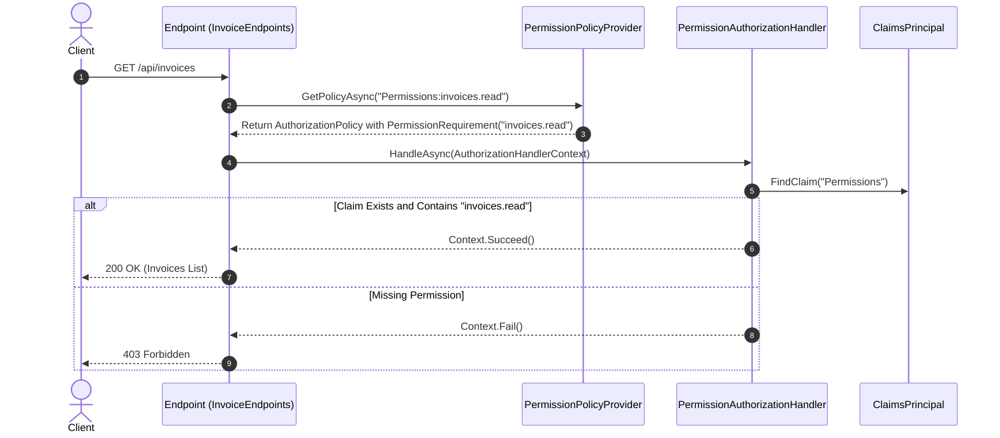

# Authorization Guide: BusinessOS Backend

## Purpose
This document details the authorization framework in BusinessOS, explaining Role-Based Access Control (RBAC), fine-grained Permission-Based Authorization, dynamic Policy Providers, and endpoint protection mechanisms.

---

## Responsibilities
* Restrict access to sensitive API endpoints based on authenticated user roles and permissions.
* Dynamically evaluate permission requirements (`PermissionPolicyProvider`) without pre-registering hundreds of policies at application startup.
* Inspect user JWT claims (`Permissions` claim) during request evaluation (`PermissionAuthorizationHandler`).
* Audit authorization failures and RBAC modifications (`RbacAuditService`).

---

## How It Works
BusinessOS implements a dynamic **Permission-Based Authorization** model on top of ASP.NET Core Policy-Based Authorization:

1. Endpoints require specific permissions (e.g. `RequirePermission("invoices.create")`).
2. `PermissionPolicyProvider` intercepts policy lookups dynamically for any string prefixed with `Permission:` and constructs a `PermissionRequirement`.
3. `PermissionAuthorizationHandler` checks the user's `Permissions` claim in `ClaimsPrincipal` to determine if the required permission string is present.

```mermaid
graph TD
    Client[HTTP Client with JWT] --> Endpoint[Endpoint: RequirePermission("invoices.create")]
    Endpoint --> DynamicProvider[PermissionPolicyProvider]
    DynamicProvider --> Requirement[PermissionRequirement("invoices.create")]
    Requirement --> Handler[PermissionAuthorizationHandler]
    Handler --> Claims[Inspect User JWT "Permissions" Claim]
    
    alt Claim Contains "invoices.create"
        Claims -->|Success| Allow[Context.Succeed()]
        Allow --> ExecuteEndpoint[Execute API Endpoint]
    else Permission Missing
        Claims -->|Failure| Deny[Context.Fail()]
        Deny --> Forbidden[HTTP 403 Forbidden]
    end
```

---

## Execution Flow



---

## Dependencies
* **Microsoft.AspNetCore.Authorization**: Core authorization infrastructure.
* **BusinessOS.Application.Common.Authorization**: Contains permission constant definitions (`Permissions.Invoices.Read`, `Permissions.Invoices.Create`, `Permissions.Orders.Manage`, etc.).

---

## Used By
* Minimal API Endpoint definitions across all 32 endpoint modules in `BusinessOS.API/Endpoints`.

---

## Calls To
* `ClaimsPrincipal.FindFirst("Permissions")`
* `RbacAuditService.LogAccessDenied()`

---

## Important Classes
* `PermissionPolicyProvider`: Implements `IAuthorizationPolicyProvider` to build policies dynamically on demand.
* `PermissionRequirement`: Implements `IAuthorizationRequirement`, encapsulating target permission string.
* `PermissionAuthorizationHandler`: Implements `AuthorizationHandler<PermissionRequirement>`, checking authorization logic.
* `PermissionAuthorizationExtensions`: Helper extension methods like `.RequirePermission(Permissions.Invoices.Read)`.

---

## Important Interfaces
* `IAuthorizationPolicyProvider`: Dynamic policy provider registration.
* `IAuthorizationHandler`: Authorization rule evaluation handler.

---

## Important Methods
* `PermissionPolicyProvider.GetPolicyAsync(string policyName)`: Checks if `policyName` starts with `Permissions:` prefix and dynamically returns policy.
* `PermissionAuthorizationHandler.HandleRequirementAsync()`: Splitting user permissions claim string by comma and checking if target permission is satisfied.

---

## Configuration
Registered in `BusinessOS.API/Program.cs`:
```csharp
builder.Services.AddSingleton<IAuthorizationPolicyProvider, PermissionPolicyProvider>();
builder.Services.AddScoped<IAuthorizationHandler, PermissionAuthorizationHandler>();
```

---

## Common Pitfalls
* **Case Sensitivity**: Permission strings must match exact casing defined in domain permission constants (e.g. `invoices.read` vs `Invoices.Read`).
* **Stale JWT Claims**: Updating a user's role/permissions in the database does not update existing unexpired JWT tokens; users must re-authenticate or refresh their token to reflect permission changes.

---

## Future Improvements
* Add resource-based authorization (e.g., checking if user owns a specific invoice entity beyond tenant boundaries).

---

## Related Documents
* [Authentication.md](file:///d:/Business_OS/BusinessOS/docs/Authentication.md)
* [Middleware.md](file:///d:/Business_OS/BusinessOS/docs/Middleware.md)
