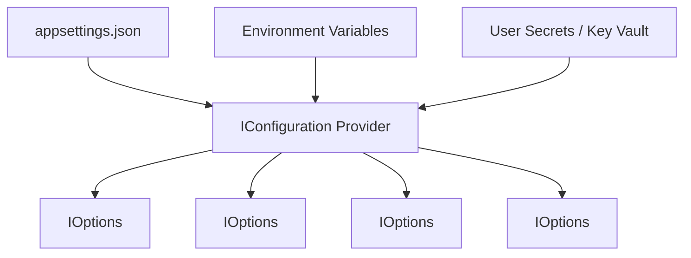

# Configuration & Environment Matrix Guide: BusinessOS Backend

## Purpose
This document provides a comprehensive configuration guide for BusinessOS, covering `appsettings.json`, environment variable overrides, strong options bindings (`IOptions<T>`), connection strings, and secret management.

---

## Responsibilities
* Provide typed option classes for application subsystems (`JwtOptions`, `AiOptions`, `QdrantOptions`, `VectorSyncOptions`, `StripeOptions`, `JazzCashOptions`, `EasyPaisaOptions`).
* Standardize configuration structures across Development, Staging, and Production environments.
* Keep credentials and API keys out of source control using environment variables.

---

## How It Works
Configuration properties are loaded during host initialization in `Program.cs`:



---

## Complete Options Matrix (`appsettings.json`)

| Section | Key | Default Value | Description |
| :--- | :--- | :--- | :--- |
| **`ConnectionStrings`** | `DefaultConnection` | `Server=localhost...` | PostgreSQL / SQL Server database connection string. |
| **`Jwt`** | `Key` | `THIS_IS_SUPER_SECRET...` | HMAC-SHA256 signing key (Min 256-bit). |
| | `Issuer` | `BusinessOS` | JWT token issuer string. |
| | `Audience` | `BusinessOSUsers` | Target consumer audience. |
| | `ExpiryMinutes` | `60` | Token expiration duration in minutes. |
| **`Ai`** | `OpenAiApiKey` | `""` | OpenAI API key for completions & embeddings. |
| | `OpenAiModel` | `gpt-4o-mini` | Default chat completion model. |
| | `OpenAiEmbeddingModel` | `text-embedding-3-small` | 1536-dimensional embedding model. |
| **`Qdrant`** | `Enabled` | `true` | Enable/Disable vector database synchronization. |
| | `Host` | `localhost` | Qdrant database host address. |
| | `Port` | `6334` | gRPC port for Qdrant client. |
| | `CollectionName` | `businessos_knowledge` | Collection vector index identifier. |
| **`VectorSync`** | `PollIntervalSeconds` | `5` | Background outbox polling frequency. |
| | `BatchSize` | `25` | Number of outbox messages processed per batch. |
| **`Stripe`** | `SecretKey` | `""` | Stripe REST API secret key (`sk_live_...`). |
| | `WebhookSecret` | `""` | Stripe Webhook signature signing secret. |
| **`Database`** | `ApplyMigrationsOnStartup`| `true` | Automatically run `DbContext.Database.Migrate()` on boot. |

---

## Environment Variable Mapping Example
To override configuration in Docker / Production environments:

```bash
export ConnectionStrings__DefaultConnection="Host=prod-db;Database=BusinessOS;Username=app;Password=secret"
export Jwt__Key="PROD_SECRET_KEY_MINIMUM_32_CHARACTERS_LONG"
export Ai__OpenAiApiKey="sk-proj-prod-key"
export Qdrant__Host="qdrant-cluster.internal"
```

---

## Dependencies
* **Microsoft.Extensions.Options**: `IOptions<T>`, `IOptionsSnapshot<T>`.

---

## Used By
* Application services and infrastructure providers across all layers.

---

## Calls To
* `builder.Services.Configure<TOptions>(builder.Configuration.GetSection("Key"))`

---

## Related Documents
* [Deployment.md](file:///d:/Business_OS/BusinessOS/docs/Deployment.md)
* [Logging.md](file:///d:/Business_OS/BusinessOS/docs/Logging.md)
