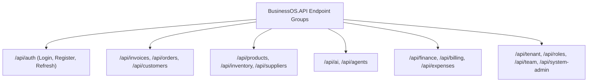

# API Endpoints Catalog (Controllers): BusinessOS Backend

## Purpose
This document serves as the complete REST Minimal API Endpoint Catalog for BusinessOS, detailing endpoint routes, HTTP verbs, request/response DTOs, authorization policies, validation rules, and security scopes.

---

## Responsibilities
* Map HTTP routes to MediatR commands and queries cleanly using ASP.NET Core Minimal APIs.
* Enforce authentication (`.RequireAuthorization()`) and permission policies (`.RequirePermission(...)`).
* Produce standard HTTP status codes (`200 OK`, `201 Created`, `204 No Content`, `400 Bad Request`, `401 Unauthorized`, `403 Forbidden`, `404 Not Found`).

---

## Endpoint Modules Map (32 Endpoint Registrations)



---

## Detailed Endpoint Route Catalog

### 1. Authentication Endpoints (`AuthEndpoints.cs`)
* `POST /api/auth/login`: Authenticates user credentials and returns JWT access token + refresh token.
* `POST /api/auth/register`: Registers a new user and tenant workspace.
* `POST /api/auth/refresh-token`: Rotates expired JWT token using valid refresh token.
* `GET /api/auth/me`: Returns active user profile, roles, and permissions.

### 2. Invoice Endpoints (`InvoiceEndpoints.cs`)
* `GET /api/invoices`: Returns paginated list of tenant invoices (Filterable by status, date, customer).
* `GET /api/invoices/{id}`: Returns detailed invoice entity graph.
* `POST /api/invoices`: Dispatches `CreateInvoiceCommand`.
* `PUT /api/invoices/{id}/status`: Updates status (`Draft`, `Sent`, `Paid`, `Void`).
* `GET /api/invoices/{id}/pdf`: Returns generated PDF file stream.

### 3. Customer Endpoints (`CustomerEndpoints.cs`)
* `GET /api/customers`: List tenant customers.
* `POST /api/customers`: Create customer record.
* `GET /api/customers/{id}/summary`: Returns customer financial summary (revenue, balance, credit limit).

### 4. AI & Agent Endpoints (`AiEndpoints.cs` & `AgentEndpoints.cs`)
* `POST /api/ai/chat`: Interactive natural language chat endpoint with context retrieval.
* `POST /api/ai/agent/execute`: Autonomous agent workflow execution endpoint.
* `GET /api/ai/conversations`: Returns conversation session history.
* `POST /api/agents/tts`: Converts text string to MP3 audio via Edge Neural TTS.

---

## Endpoint Implementation Pattern Example

```csharp
public static class InvoiceEndpoints
{
    public static void MapInvoiceEndpoints(this IEndpointRouteBuilder app)
    {
        var group = app.MapGroup("/api/invoices")
            .RequireAuthorization()
            .WithTags("Invoices");

        group.MapPost("/", async (
            CreateInvoiceCommand command,
            IMediator mediator,
            CancellationToken ct) =>
        {
            var result = await mediator.Send(command, ct);
            return result.IsSuccess
                ? Results.Created($"/api/invoices/{result.Value.Id}", result.Value)
                : Results.BadRequest(result.Error);
        })
        .RequirePermission(Permissions.Invoices.Create)
        .WithName("CreateInvoice");
    }
}
```

---

## Dependencies
* **Microsoft.AspNetCore.Routing**: `IEndpointRouteBuilder`, `MapGroup`, `MapPost`, `MapGet`.
* **MediatR**: `IMediator.Send()`.

---

## Used By
* Frontend applications, API integration partners, mobile apps.

---

## Calls To
* `IMediator` CQRS pipeline.

---

## Security Matrix
All endpoints require `Authorization: Bearer <JWT>` header unless marked with `.AllowAnonymous()` (e.g. `/api/auth/login`, `/api/auth/register`, `/health`).

---

## Related Documents
* [API-Flow.md](file:///d:/Business_OS/BusinessOS/docs/API-Flow.md)
* [Authorization.md](file:///d:/Business_OS/BusinessOS/docs/Authorization.md)
