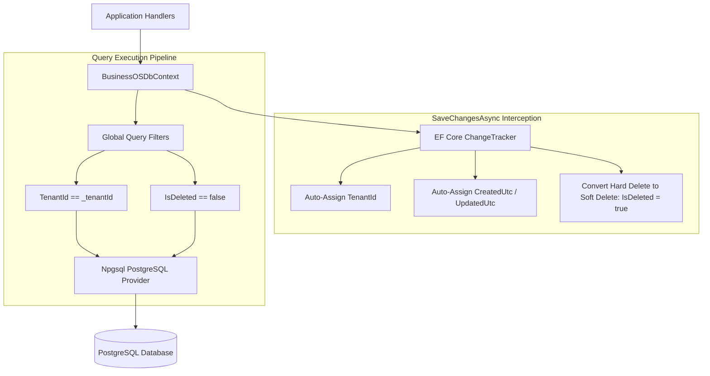
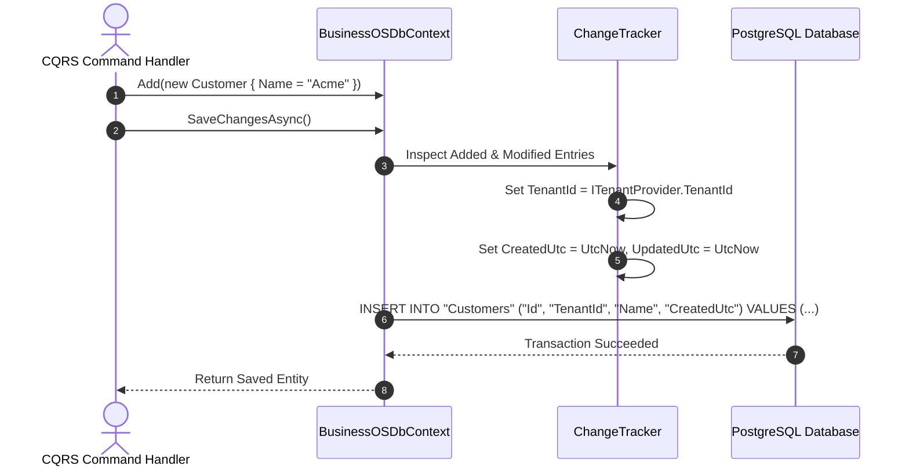

# Database Architecture Guide: BusinessOS Backend

## Purpose
This document provides a comprehensive analysis of the Database Architecture in BusinessOS, explaining Entity Framework Core 10, PostgreSQL (`Npgsql`), DbContext configuration, Multi-Tenant global query filters, Soft Delete interceptors, Automated Auditing, and Migration management.

---

## Responsibilities
* Persist domain entities in PostgreSQL using Entity Framework Core 10.
* Enforce strict database multi-tenancy isolation via EF Core Global Query Filters (`TenantId`).
* Intercept `SaveChangesAsync()` to automatically populate audit timestamps (`CreatedUtc`, `UpdatedUtc`) and tenant IDs.
* Support soft deletion (`ISoftDelete`) to prevent physical data loss while filtering deleted records automatically.
* Manage index optimizations, foreign keys, cascade delete behavior, and schema migrations.

---

## How It Works
`BusinessOSDbContext` extends ASP.NET Core `IdentityDbContext<ApplicationUser, ApplicationRole, string>` and implements `IApplicationDbContext`.



---

## Execution Flow



---

## Global Query Filters

`BusinessOSDbContext.OnModelCreating()` applies global query filters automatically to every entity possessing `TenantId` or `IsDeleted` properties:

```csharp
// Multi-tenancy filter
builder.Entity<Customer>().HasQueryFilter(e => e.TenantId == _tenantId);

// Soft delete filter
builder.Entity<Invoice>().HasQueryFilter(e => !e.IsDeleted);
```

### Bypassing Global Filters
For super-admin system cross-tenant queries, global filters are explicitly bypassed using `.IgnoreQueryFilters()`:
```csharp
var allTenantsInvoices = await _dbContext.Invoices
    .IgnoreQueryFilters()
    .Where(x => x.Status == InvoiceStatus.Overdue)
    .ToListAsync();
```

---

## Entity Base Classes

### 1. `BaseEntity`
```csharp
public abstract class BaseEntity
{
    public Guid Id { get; set; } = Guid.NewGuid();
}
```

### 2. `AuditableEntity`
```csharp
public abstract class AuditableEntity : BaseEntity, ISoftDelete
{
    public Guid TenantId { get; set; }
    public DateTime CreatedUtc { get; set; } = DateTime.UtcNow;
    public string? CreatedBy { get; set; }
    public DateTime? UpdatedUtc { get; set; }
    public string? UpdatedBy { get; set; }
    public bool IsDeleted { get; set; }
    public DateTime? DeletedUtc { get; set; }
}
```

---

## Key DbSets Catalog (49 Entity Sets)
* **Core Business**: `Tenants`, `Customers`, `Suppliers`, `Products`, `Categories`, `Inventories`, `StockTransactions`.
* **Sales & Finance**: `Orders`, `OrderItems`, `Invoices`, `Payments`, `Quotations`, `Expenses`, `BillingInvoices`.
* **AI & Agent**: `AIConversations`, `AiDocument`, `AiDocumentChunk`, `AgentProfile`, `AgentWorkflowRun`.
* **System & Vector**: `VectorSyncOutboxMessages`, `EntityAuditLogs`, `RbacAuditLogs`, `TenantAuditLogs`.

---

## Dependencies
* **Npgsql.EntityFrameworkCore.PostgreSQL**: EF Core PostgreSQL database provider.
* **Microsoft.AspNetCore.Identity.EntityFrameworkCore**: Identity tables integration.

---

## Used By
* `BusinessOS.Infrastructure` repositories and application services.
* CQRS feature handlers inside `BusinessOS.Application`.

---

## Calls To
* `Npgsql` driver.
* PostgreSQL database instance.

---

## Important Classes
* `BusinessOSDbContext`: Main EF Core DbContext class.
* `BusinessOSDbContextFactory`: Design-time DbContext factory for `dotnet ef migrations`.
* `AuditableEntity`: Base class with audit & tenant fields.

---

## Important Interfaces
* `IApplicationDbContext`: Abstraction interface used in `BusinessOS.Application`.
* `ITenantProvider`: Provides tenant ID resolution during DbContext construction.
* `ISoftDelete`: Soft deletion flag contract.

---

## Important Methods
* `SaveChangesAsync()`: Intercepts entity modifications before SQL execution.
* `ApplyTenantAndAuditRules()`: Populates tenant and timestamp values.

---

## Configuration
Database connection string configured in `appsettings.json`:
```json
{
  "ConnectionStrings": {
    "DefaultConnection": "Host=localhost;Database=BusinessOSDb;Username=postgres;Password=postgres"
  }
}
```

---

## Common Pitfalls
* **Raw SQL Bypassing Tenant Filters**: Executing `FromSqlRaw()` raw SQL bypasses global query filters. Developers must manually append `WHERE "TenantId" = @tenantId`.

---

## Future Improvements
* Add Read-Replica connection strings for separating read-only queries from write commands.

---

## Related Documents
* [Entity-Relationships.md](file:///d:/Business_OS/BusinessOS/docs/Entity-Relationships.md)
* [Vector-Search.md](file:///d:/Business_OS/BusinessOS/docs/Vector-Search.md)
