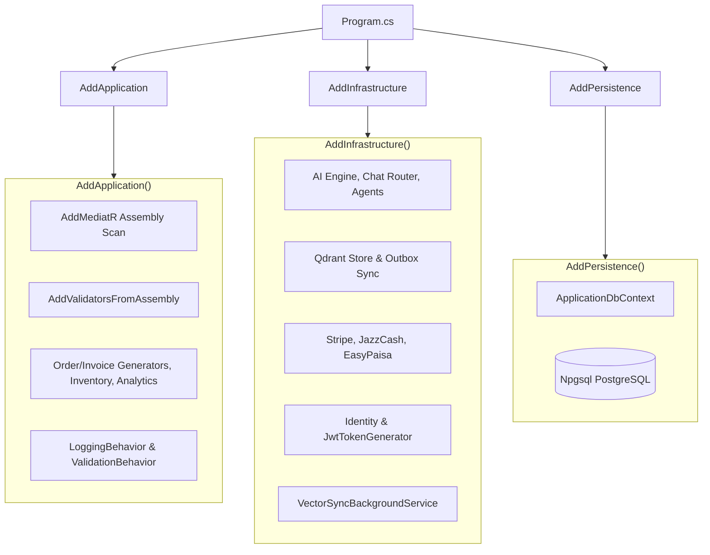
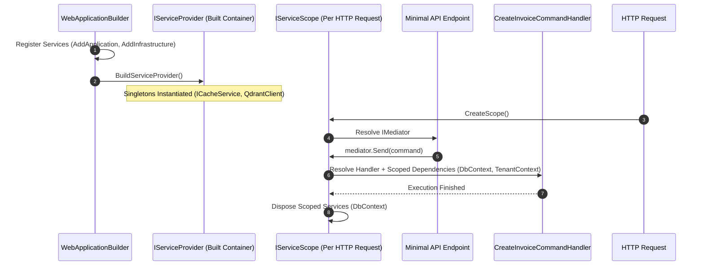

# Dependency Injection Guide: BusinessOS Backend

## Purpose
This document provides a complete guide to IoC (Inversion of Control) and Dependency Injection (DI) in BusinessOS, explaining service lifetimes, assembly scanning, extensions methods, and layer registration.

---

## Responsibilities
* Manage component creation and lifecycle management across `Transient`, `Scoped`, and `Singleton` scopes.
* Register application handlers, MediatR pipeline behaviors, and FluentValidation rules dynamically via assembly scanning.
* Decouple domain and application interfaces from concrete infrastructure implementations.

---

## How It Works
BusinessOS configures DI through modular extension methods attached to `IServiceCollection`:

1. `builder.Services.AddApplication()` (`BusinessOS.Application/DependencyInjection.cs`)
2. `builder.Services.AddInfrastructure(builder.Configuration)` (`BusinessOS.Infrastructure/DependencyInjection.cs`)
3. `builder.Services.AddPersistence(builder.Configuration)` (`BusinessOS.Persistence`)
4. Direct API registrations in `BusinessOS.API/Program.cs`.



---

## Execution Flow



---

## Service Lifetime Breakdown

| Lifetime | Description | Key Services Registered |
| :--- | :--- | :--- |
| **`Singleton`** | Created once per application lifetime; shared across all requests. | `ICacheService`, `QdrantVectorStore`, `PermissionPolicyProvider`, `IOptions<T>` settings |
| **`Scoped`** | Created once per HTTP request scope; disposed when request ends. | `ApplicationDbContext`, `ITenantContext`, `ICurrentUserService`, `IInvoiceService`, `IAuthService` |
| **`Transient`** | Created every time requested from container. | `IPipelineBehavior<,>` (`LoggingBehavior`, `ValidationBehavior`), `IValidator<T>` |

---

## Dependencies
* **Microsoft.Extensions.DependencyInjection**: Core IoC container.
* **MediatR**: `AddMediatR` scanner.
* **FluentValidation.DependencyInjectionExtensions**: `AddValidatorsFromAssembly`.

---

## Used By
* ASP.NET Core Web Host (`BusinessOS.API/Program.cs`).

---

## Calls To
* `IServiceCollection.AddScoped()`, `AddSingleton()`, `AddTransient()`.

---

## Important Classes
* `BusinessOS.Application.DependencyInjection`: Registers MediatR CQRS handlers, validators, generators, and behaviors.
* `BusinessOS.Infrastructure.DependencyInjection`: Registers database, identity, vector search, AI agents, payment gateways, and background services.

---

## Important Interfaces
* `IServiceCollection`: Service registration API contract.
* `IServiceProvider`: Dependency resolution factory contract.

---

## Important Methods
* `AddApplication(this IServiceCollection services)`
* `AddInfrastructure(this IServiceCollection services, IConfiguration configuration)`

---

## Configuration
Option patterns (`IOptions<T>`) are registered into DI:
```csharp
services.Configure<AiOptions>(configuration.GetSection("Ai"));
services.Configure<JwtOptions>(configuration.GetSection("Jwt"));
services.Configure<QdrantOptions>(configuration.GetSection("Qdrant"));
```

---

## Common Pitfalls
* **Captive Dependencies**: Injecting a `Scoped` service (like `ApplicationDbContext` or `ITenantContext`) into a `Singleton` service (like `CacheService`) causes state corruption across requests.
* **Missing Service Registration**: Injecting an unregistered interface throws a `InvalidOperationException: No service for type '...' has been registered` at runtime.

---

## Future Improvements
* Add Scrutor for automatic assembly convention scanning of repositories and application services.

---

## Related Documents
* [Architecture.md](file:///d:/Business_OS/BusinessOS/docs/Architecture.md)
* [Services.md](file:///d:/Business_OS/BusinessOS/docs/Services.md)
