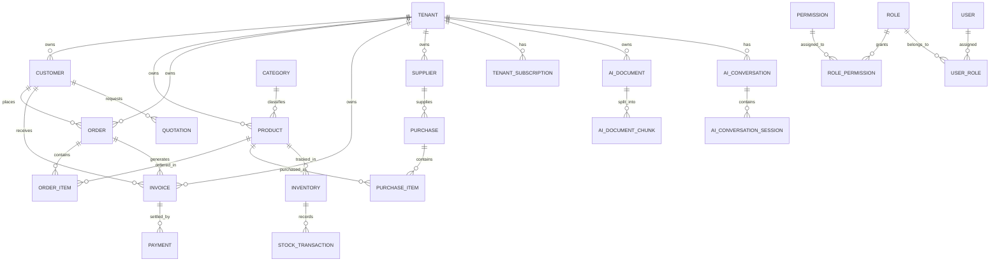
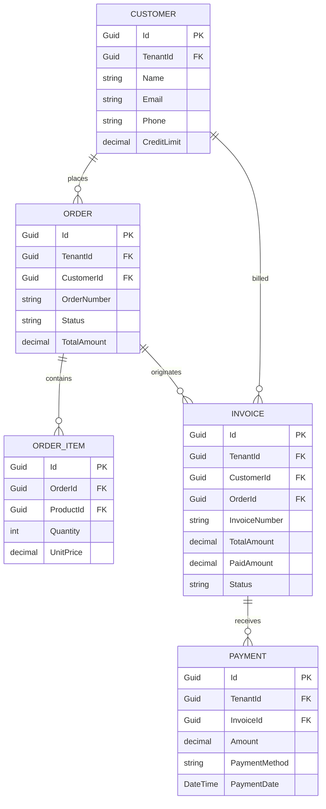
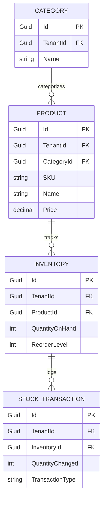
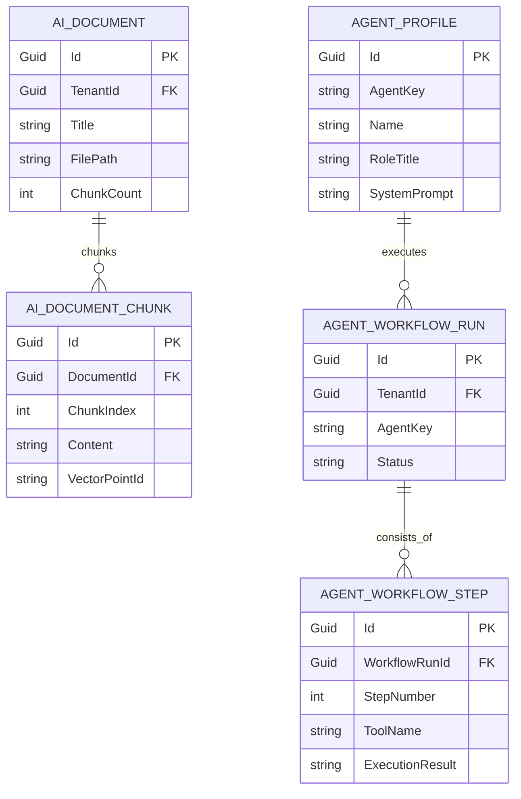

# Entity Relationships Guide (ERD): BusinessOS Backend

## Purpose
This document provides a comprehensive domain entity reference and Entity-Relationship Diagram (ERD) catalog for BusinessOS, covering Multi-Tenancy, Customer & Sales, Inventory & Procurement, Finance & Billing, AI Agent & RAG, and RBAC Audit models.
# Role

You are a Senior Software Architect, Technical Writer, and .NET Documentation Engineer.

Your task is to analyze my entire BusinessOS backend and generate comprehensive, professional, and maintainable documentation.

IMPORTANT:

* DO NOT modify any business logic.
* DO NOT change application behavior.
* DO NOT refactor existing code.
* DO NOT rename files, classes, methods, variables, or folders.
* DO NOT install or remove packages.
* DO NOT change dependencies.
* DO NOT modify API behavior.
* DO NOT change database models.
* DO NOT modify configuration.
* DO NOT change authentication.
* DO NOT change authorization.
* DO NOT touch any production code unless it is only adding documentation comments.

Your job is documentation only.

---

# Documentation Goals

I want my project to be understandable by someone opening it for the first time.

Generate documentation that explains:

* Overall Architecture
* Request Lifecycle
* Module Relationships
* Business Flow
* AI Agent
* RAG
* CQRS
* Dependency Injection
* Middleware
* Authentication
* Authorization
* Multi-tenancy
* Database
* Background Services
* External APIs
* OpenAI Integration
* Vector Database Integration (if present)
* Error Handling
* Logging
* Configuration
* Folder Structure

Everything should be documented.

---

# Create a /docs folder

Create a documentation folder:

/docs

Inside it create organized documentation.

Example:

docs/
│
├── README.md
├── Architecture.md
├── Folder-Structure.md
├── Request-Lifecycle.md
├── Authentication.md
├── Authorization.md
├── Dependency-Injection.md
├── Middleware.md
├── CQRS.md
├── AI-Agent.md
├── RAG.md
├── Prompt-Pipeline.md
├── Vector-Search.md
├── Database.md
├── Entity-Relationships.md
├── Services.md
├── Controllers.md
├── API-Flow.md
├── Configuration.md
├── Logging.md
├── Error-Handling.md
├── Deployment.md
├── Workflows.md
└── diagrams/

---

# Every document must contain

Every document should include:

Purpose

Responsibilities

How it works

Execution Flow

Dependencies

Used By

Calls To

Important Classes

Important Interfaces

Important Methods

Configuration

Common Pitfalls

Future Improvements

Related Documents

---

# Generate Mermaid Diagrams

Generate Mermaid diagrams throughout the documentation wherever they improve understanding.

Examples include:

## System Architecture

graph TD

Frontend --> API

API --> Controllers

Controllers --> MediatR

MediatR --> Handlers

Handlers --> Services

Services --> Database

Services --> AI

AI --> OpenAI

AI --> Vector Database

---

## Request Flow

sequenceDiagram

User->>Controller

Controller->>Handler

Handler->>Service

Service->>Database

Database-->>Service

Service-->>Handler

Handler-->>Controller

Controller-->>User

---

## AI Agent Flow

graph TD

User

↓

Planner

↓

Memory

↓

Tool Selection

↓

Execute Tool

↓

Collect Results

↓

Prompt Builder

↓

LLM

↓

Final Response

---

## RAG Flow

graph TD

User Question

↓

Generate Embedding

↓

Vector Search

↓

Top Documents

↓

Prompt Builder

↓

LLM

↓

Response

---

## Middleware Pipeline

graph LR

Request

→ Exception Middleware

→ Authentication

→ Authorization

→ Tenant Resolution

→ Logging

→ Controller

→ Response

---

## Dependency Injection Flow

graph TD

Program.cs

↓

Service Collection

↓

Repositories

↓

Services

↓

Handlers

↓

Controllers

---

## CQRS Flow

graph TD

Controller

↓

Command

↓

Handler

↓

Domain

↓

Repository

↓

Database

---

## Database Relationships

Generate Mermaid ER diagrams describing relationships among entities.

---

# Analyze Every Controller

For every controller explain:

Purpose

Endpoints

Request Models

Response Models

Validation

Called Services

Security

Example Request

Example Response

Execution Flow

Generate Mermaid sequence diagrams for every important endpoint.

---

# Analyze Every Service

For every service explain:

Responsibilities

Public Methods

Private Methods

Dependencies

Used By

Calls To

Business Rules

Execution Flow

Generate diagrams.

---

# Analyze AI Components

If AI-related code exists, explain:

Prompt construction

Memory

Tool calling

Planning

Execution

Retry logic

Conversation flow

Model selection

Streaming

Context management

Generate workflow diagrams.

---

# Analyze RAG

Explain in detail:

Document ingestion

Chunking

Embedding generation

Embedding storage

Vector search

Similarity search

Context retrieval

Prompt creation

LLM call

Response generation

Generate complete diagrams.

---

# Analyze Database

Document:

Entities

Relationships

Primary Keys

Foreign Keys

Indexes

Soft Delete

Auditing

Tenant filtering

Generate Mermaid ER diagrams.

---

# Generate Call Graphs

For important methods generate call graphs showing:

Who calls this method?

Which methods are called?

Execution order.

---

# Folder Documentation

Explain every folder:

Purpose

Contains

Dependencies

Used by

Typical lifecycle

---

# XML Documentation

Where appropriate, add XML documentation comments to public classes, interfaces, methods, and properties.

Example:

* Summary
* Parameters
* Returns
* Remarks

Do not alter implementation.

---

# README

Generate a professional README including:

Project overview

Architecture

Features

Technology stack

Folder structure

How to run

Environment variables

Database setup

API documentation

Documentation index

Development workflow

Contributing guide

License placeholder

---

# Documentation Quality

Documentation should be:

Professional

Beginner friendly

Senior developer quality

Easy to navigate

Well structured

Markdown formatted

Consistent

No duplicated explanations

Clear headings

Tables where useful

Cross-links between documents

---

# Safety Rules

Never modify application behavior.

Never change business logic.

Never rename existing code.

Never delete files.

Never change APIs.

Never alter database schema.

Never change configuration.

Never change dependency injection registrations.

Only add documentation, Markdown files, Mermaid diagrams, and XML comments where safe.

If uncertain, prefer documenting rather than editing code.

---

# Final Deliverable

When finished:

1. Generate the complete `/docs` directory.
2. Create all Markdown documents.
3. Generate Mermaid diagrams throughout the documentation.
4. Update the root `README.md` with links to all documentation.
5. Add XML documentation comments where appropriate.
6. Ensure the project builds exactly as before.
7. Provide a summary listing:

   * Files created
   * Files documented
   * Diagrams generated
   * Any areas that could not be documented automatically.
# Role

You are a Senior Software Architect, Technical Writer, and .NET Documentation Engineer.

Your task is to analyze my entire BusinessOS backend and generate comprehensive, professional, and maintainable documentation.

IMPORTANT:

* DO NOT modify any business logic.
* DO NOT change application behavior.
* DO NOT refactor existing code.
* DO NOT rename files, classes, methods, variables, or folders.
* DO NOT install or remove packages.
* DO NOT change dependencies.
* DO NOT modify API behavior.
* DO NOT change database models.
* DO NOT modify configuration.
* DO NOT change authentication.
* DO NOT change authorization.
* DO NOT touch any production code unless it is only adding documentation comments.

Your job is documentation only.

---

# Documentation Goals

I want my project to be understandable by someone opening it for the first time.

Generate documentation that explains:

* Overall Architecture
* Request Lifecycle
* Module Relationships
* Business Flow
* AI Agent
* RAG
* CQRS
* Dependency Injection
* Middleware
* Authentication
* Authorization
* Multi-tenancy
* Database
* Background Services
* External APIs
* OpenAI Integration
* Vector Database Integration (if present)
* Error Handling
* Logging
* Configuration
* Folder Structure

Everything should be documented.

---

# Create a /docs folder

Create a documentation folder:

/docs

Inside it create organized documentation.

Example:

docs/
│
├── README.md
├── Architecture.md
├── Folder-Structure.md
├── Request-Lifecycle.md
├── Authentication.md
├── Authorization.md
├── Dependency-Injection.md
├── Middleware.md
├── CQRS.md
├── AI-Agent.md
├── RAG.md
├── Prompt-Pipeline.md
├── Vector-Search.md
├── Database.md
├── Entity-Relationships.md
├── Services.md
├── Controllers.md
├── API-Flow.md
├── Configuration.md
├── Logging.md
├── Error-Handling.md
├── Deployment.md
├── Workflows.md
└── diagrams/

---

# Every document must contain

Every document should include:

Purpose

Responsibilities

How it works

Execution Flow

Dependencies

Used By

Calls To

Important Classes

Important Interfaces

Important Methods

Configuration

Common Pitfalls

Future Improvements

Related Documents

---

# Generate Mermaid Diagrams

Generate Mermaid diagrams throughout the documentation wherever they improve understanding.

Examples include:

## System Architecture

graph TD

Frontend --> API

API --> Controllers

Controllers --> MediatR

MediatR --> Handlers

Handlers --> Services

Services --> Database

Services --> AI

AI --> OpenAI

AI --> Vector Database

---

## Request Flow

sequenceDiagram

User->>Controller

Controller->>Handler

Handler->>Service

Service->>Database

Database-->>Service

Service-->>Handler

Handler-->>Controller

Controller-->>User

---

## AI Agent Flow

graph TD

User

↓

Planner

↓

Memory

↓

Tool Selection

↓

Execute Tool

↓

Collect Results

↓

Prompt Builder

↓

LLM

↓

Final Response

---

## RAG Flow

graph TD

User Question

↓

Generate Embedding

↓

Vector Search

↓

Top Documents

↓

Prompt Builder

↓

LLM

↓

Response

---

## Middleware Pipeline

graph LR

Request

→ Exception Middleware

→ Authentication

→ Authorization

→ Tenant Resolution

→ Logging

→ Controller

→ Response

---

## Dependency Injection Flow

graph TD

Program.cs

↓

Service Collection

↓

Repositories

↓

Services

↓

Handlers

↓

Controllers

---

## CQRS Flow

graph TD

Controller

↓

Command

↓

Handler

↓

Domain

↓

Repository

↓

Database

---

## Database Relationships

Generate Mermaid ER diagrams describing relationships among entities.

---

# Analyze Every Controller

For every controller explain:

Purpose

Endpoints

Request Models

Response Models

Validation

Called Services

Security

Example Request

Example Response

Execution Flow

Generate Mermaid sequence diagrams for every important endpoint.

---

# Analyze Every Service

For every service explain:

Responsibilities

Public Methods

Private Methods

Dependencies

Used By

Calls To

Business Rules

Execution Flow

Generate diagrams.

---

# Analyze AI Components

If AI-related code exists, explain:

Prompt construction

Memory

Tool calling

Planning

Execution

Retry logic

Conversation flow

Model selection

Streaming

Context management

Generate workflow diagrams.

---

# Analyze RAG

Explain in detail:

Document ingestion

Chunking

Embedding generation

Embedding storage

Vector search

Similarity search

Context retrieval

Prompt creation

LLM call

Response generation

Generate complete diagrams.

---

# Analyze Database

Document:

Entities

Relationships

Primary Keys

Foreign Keys

Indexes

Soft Delete

Auditing

Tenant filtering

Generate Mermaid ER diagrams.

---

# Generate Call Graphs

For important methods generate call graphs showing:

Who calls this method?

Which methods are called?

Execution order.

---

# Folder Documentation

Explain every folder:

Purpose

Contains

Dependencies

Used by

Typical lifecycle

---

# XML Documentation

Where appropriate, add XML documentation comments to public classes, interfaces, methods, and properties.

Example:

* Summary
* Parameters
* Returns
* Remarks

Do not alter implementation.

---

# README

Generate a professional README including:

Project overview

Architecture

Features

Technology stack

Folder structure

How to run

Environment variables

Database setup

API documentation

Documentation index

Development workflow

Contributing guide

License placeholder

---

# Documentation Quality

Documentation should be:

Professional

Beginner friendly

Senior developer quality

Easy to navigate

Well structured

Markdown formatted

Consistent

No duplicated explanations

Clear headings

Tables where useful

Cross-links between documents

---

# Safety Rules

Never modify application behavior.

Never change business logic.

Never rename existing code.

Never delete files.

Never change APIs.

Never alter database schema.

Never change configuration.

Never change dependency injection registrations.

Only add documentation, Markdown files, Mermaid diagrams, and XML comments where safe.

If uncertain, prefer documenting rather than editing code.

---

# Final Deliverable

When finished:

1. Generate the complete `/docs` directory.
2. Create all Markdown documents.
3. Generate Mermaid diagrams throughout the documentation.
4. Update the root `README.md` with links to all documentation.
5. Add XML documentation comments where appropriate.
6. Ensure the project builds exactly as before.
7. Provide a summary listing:

   * Files created
   * Files documented
   * Diagrams generated
   * Any areas that could not be documented automatically.

---

## Responsibilities
* Document entity schema fields, primary keys, foreign keys, and navigational properties.
* Visualize domain entity relationships using standard Mermaid ER diagrams.
* Serve as the authoritative data model dictionary for backend developers and database administrators.

---

## Complete Domain Entity ERD

---

## Module ERD Sub-Diagrams

### 1. Sales & Invoicing ERD

---

### 2. Inventory & Stock Management ERD

---

### 3. AI Agent & Vector RAG ERD

---

## Primary & Foreign Key Conventions
* **Primary Keys (`PK`)**: Standardized `Guid Id` generated via `Guid.NewGuid()` on `BaseEntity`.
* **Foreign Keys (`FK`)**: Naming convention matches target entity name + `Id` (e.g. `CustomerId`, `OrderId`, `TenantId`).
* **Multi-Tenant Key**: Every auditable business entity contains `Guid TenantId` referencing `Tenant.Id`.

---

## Dependencies
* Implemented in `BusinessOS.Domain/Entities/*.cs`.
* Configured in `BusinessOS.Persistence/Configurations/*.cs`.

---

## Used By
* `BusinessOSDbContext` EF Core ORM mappings.

---

## Related Documents
* [Database.md](file:///d:/Business_OS/BusinessOS/docs/Database.md)
* [Architecture.md](file:///d:/Business_OS/BusinessOS/docs/Architecture.md)
