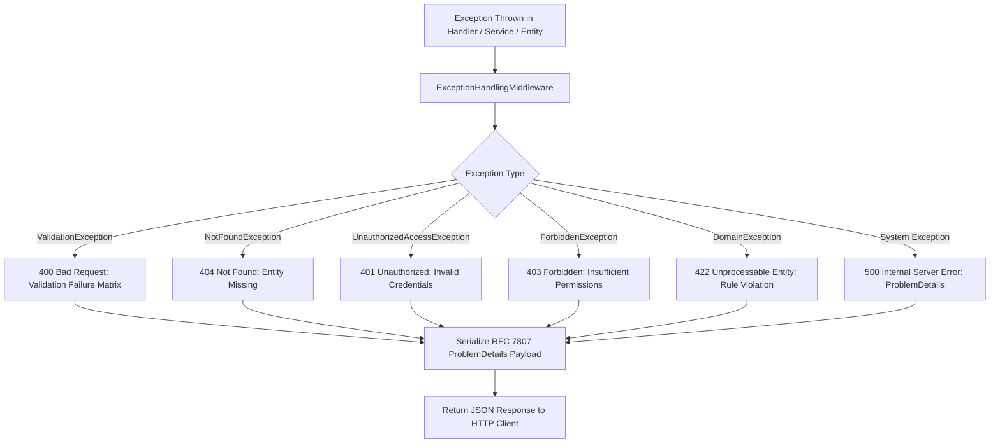

# Global Error Handling Guide: BusinessOS Backend

## Purpose
This document details the central Exception Handling Architecture in BusinessOS, explaining custom domain exceptions, FluentValidation exception mappings, HTTP `ProblemDetails` standardization (RFC 7807), and error handling best practices.

---

## Responsibilities
* Prevent unhandled server exceptions from leaking internal stack traces or database schema details to API consumers.
* Standardize error response payloads across all 32 endpoint modules.
* Map domain exceptions (`NotFoundException`, `ValidationException`, `UnauthorizedAccessException`, `DomainException`) to appropriate HTTP status codes.

---

## How It Works
All unhandled exceptions bubble up to `ExceptionHandlingMiddleware` (`BusinessOS.API/Middleware/ExceptionHandlingMiddleware.cs`).



---

## RFC 7807 ProblemDetails Structure Example

```json
{
  "type": "https://tools.ietf.org/html/rfc7231#section-6.5.1",
  "title": "Validation Failed",
  "status": 400,
  "detail": "One or more validation errors occurred.",
  "instance": "/api/invoices",
  "traceId": "0HMV89JFK201L:00000001",
  "errors": {
    "CustomerId": ["Customer ID must not be empty."],
    "Items": ["Invoice must contain at least one line item."]
  }
}
```

---

## Domain Exceptions Catalog (`BusinessOS.Application/Common/Exceptions`)
* `ValidationException`: Thrown by `ValidationBehavior` when FluentValidation rules fail.
* `NotFoundException`: Thrown when querying an entity by ID returns `null`.
* `ForbiddenException`: Thrown when a tenant attempts to access records belonging to another tenant.
* `DomainException`: Thrown when domain business invariants are violated (e.g. attempting to pay an already voided invoice).

---

## Dependencies
* **Microsoft.AspNetCore.Http**: `ProblemDetails`, `BadHttpRequestException`.
* **FluentValidation**: `ValidationFailure`.

---

## Used By
* ASP.NET Core Middleware Pipeline in `BusinessOS.API`.

---

## Calls To
* `JsonSerializer.SerializeAsync()`
* `ILogger.LogError()`

---

## Related Documents
* [Middleware.md](file:///d:/Business_OS/BusinessOS/docs/Middleware.md)
* [Request-Lifecycle.md](file:///d:/Business_OS/BusinessOS/docs/Request-Lifecycle.md)
