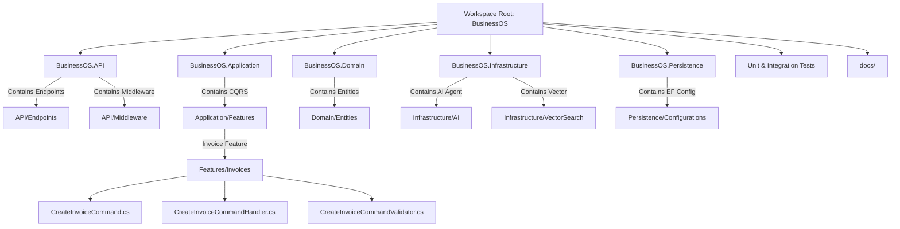

# Folder Structure Guide: BusinessOS Backend

## Purpose
This document provides a comprehensive mapping of the BusinessOS repository folder structure, project layouts, source files, and directory responsibilities.

---

## Responsibilities
* Maintain clear organizational boundaries for source code, configuration, tests, and documentation.
* Provide clear file locator guidance for developers introducing new features, entities, handlers, or endpoints.

---

## How It Works
The repository root contains the solution file (`BusinessOS.slnx`), configuration manifest (`Directory.Packages.props`), deployment scripts (`docker-compose.yml`), documentation (`/docs`), and 5 primary source project folders alongside 2 test projects.

```
BusinessOS/
├── .github/                      # GitHub Actions workflows & CI/CD pipelines
├── docs/                         # Project architecture & system documentation
├── BusinessOS.slnx               # Visual Studio solution file (.NET 10 solution XML)
├── Directory.Build.props         # Centralized MSBuild properties
├── Directory.Packages.props      # Centralized NuGet Package Management (CPM)
├── docker-compose.yml            # Local development orchestration (PostgreSQL, Qdrant)
│
├── BusinessOS.Domain/            # Domain Entities, Enums, Interfaces, Value Objects
│   ├── Common/                   # Base entity abstractions (BaseEntity, AuditableEntity)
│   ├── Entities/                 # 49+ Domain Entities (Tenant, Invoice, Order, AI, etc.)
│   └── Enums/                    # System Domain Enums (OrderStatus, PaymentMethod, etc.)
│
├── BusinessOS.Application/       # Use Cases, CQRS Handlers, Behaviors, Interfaces
│   ├── Behaviors/                # MediatR Pipeline Behaviors (Validation, Logging)
│   ├── Common/                   # Application DTOs, Exceptions, Interfaces
│   ├── Features/                 # 34 CQRS Feature folders (Commands, Queries, Handlers)
│   └── DependencyInjection.cs    # Application layer service registration
│
├── BusinessOS.Infrastructure/    # External Services, AI Agent, Vector Store, Identity
│   ├── AI/                       # AI Engine, Agents, Prompt Builders, Chat Router
│   ├── Data/                     # Initializers & Seed Data generators
│   ├── Diagnostics/              # Health Checks & Telemetry
│   ├── Identity/                 # ApplicationUser & ApplicationRole Identity models
│   ├── Migrations/               # EF Core PostgreSQL database migrations
│   ├── MultiTenancy/             # Tenant context resolution & headers parser
│   ├── Payments/                 # Payment Provider Integrations (Stripe, JazzCash, EasyPaisa)
│   ├── Repositories/             # Generic Repository pattern implementations
│   ├── Services/                 # 37+ Application Service Implementations
│   ├── VectorSearch/             # Qdrant Vector Store, Outbox Interceptor & Background Sync
│   └── DependencyInjection.cs    # Infrastructure service registration
│
├── BusinessOS.Persistence/       # EF Core DbContext & Entity Configurations
│   └── Configurations/           # EF Core Fluent API Entity configurations
│
├── BusinessOS.API/               # Web Host, Minimal Endpoints, Middleware, SignalR
│   ├── Authorization/            # Permission authorization handlers & policies
│   ├── Endpoints/                # 32 Endpoint Registration files (InvoiceEndpoints, etc.)
│   ├── Hubs/                     # SignalR Real-time Notification & AI Hubs
│   ├── Middleware/               # HTTP Pipeline Middlewares (Exception, Tenant, Serilog)
│   ├── OpenApi/                  # OpenAPI / Swagger specs & filters
│   ├── Program.cs                # Web Application entry point
│   └── appsettings.json          # Production & Development JSON configuration
│
├── BusinessOS.UnitTests/         # Unit Tests (Domain, Handlers, Behaviors)
└── BusinessOS.IntegrationTests/  # WebApplicationFactory Integration Tests
```

---

## Execution Flow



---

## Dependencies
* Organized in strict hierarchical order: `API` -> `Infrastructure` & `Persistence` -> `Application` -> `Domain`.

---

## Used By
* Solution developers navigating codebase files during feature delivery or bug fixing.

---

## Calls To
* Solution files located throughout the project tree.

---

## Important Classes
* `Directory.Packages.props`: Manages all NuGet package versioning centrally across projects.
* `BusinessOS.Application.DependencyInjection`: Registers MediatR, FluentValidation, and application behaviors.
* `BusinessOS.Infrastructure.DependencyInjection`: Registers Qdrant, OpenAI, Payment gateways, identity, and background services.

---

## Important Interfaces
* N/A (Folder configuration file reference).

---

## Important Methods
* N/A.

---

## Configuration
* Root `.editorconfig` enforces C# formatting, brace styling, and naming conventions across all folders.

---

## Common Pitfalls
* **Placing Logic in API/Endpoints**: Business logic should remain inside `BusinessOS.Application/Features/[FeatureName]`. Endpoints must strictly parse requests and send MediatR commands.
* **Adding Infrastructure Dependencies to Domain**: `BusinessOS.Domain` must never reference NuGet packages like EF Core, Qdrant, or Newtonsoft.Json.

---

## Future Improvements
* Modularize feature folders into standalone assemblies if migrating towards microservices or modular monoliths in the future.

---

## Related Documents
* [Architecture.md](file:///d:/Business_OS/BusinessOS/docs/Architecture.md)
* [CQRS.md](file:///d:/Business_OS/BusinessOS/docs/CQRS.md)
