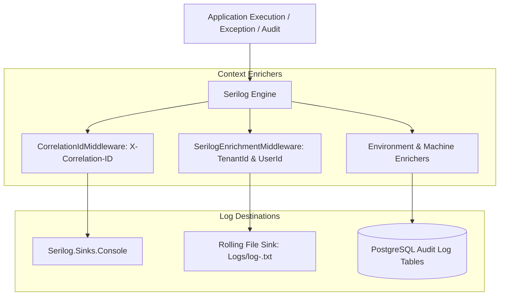

# Structured Logging & Audit Trail Guide: BusinessOS Backend

## Purpose
This document details the Structured Logging and Auditing architecture in BusinessOS, explaining Serilog sinks, log context enrichment, correlation tracking, performance metric thresholds, entity mutation auditing (`EntityAuditLog`), and RBAC modification tracking (`RbacAuditLog`).

---

## Responsibilities
* Emit structured JSON/console logs across all solution layers.
* Enrich every log statement automatically with `CorrelationId`, `TenantId`, `UserId`, `MachineName`, and `EnvironmentName`.
* Log slow requests automatically via `LoggingBehavior` when execution exceeds performance warning thresholds.
* Maintain permanent relational audit records (`EntityAuditLog`, `RbacAuditLog`, `TenantAuditLog`, `AiCopilotAuditLog`) for compliance and security auditing.

---

## How It Works
BusinessOS configures **Serilog** as its central logging engine in `Program.cs`.



---

## Audit Logs Schema Overview

### 1. `EntityAuditLog`
Tracks row-level entity mutations across tracked domain entities:
* `EntityName`: e.g. `Invoice`, `Customer`, `Product`.
* `EntityId`: Unique ID of mutated entity.
* `Action`: `Created`, `Updated`, `Deleted`.
* `OldValues`: JSON snapshot of prior state.
* `NewValues`: JSON snapshot of updated state.
* `ChangedColumns`: Comma-separated modified properties list.

### 2. `RbacAuditLog`
Tracks security and permission modifications:
* `Action`: `RoleCreated`, `RoleAssigned`, `PermissionGranted`, `UserDisabled`.
* `TargetUserId` / `TargetRoleId`.
* `PerformedByUserId`.

---

## Performance Warning Thresholds (`appsettings.json`)
```json
{
  "Logging": {
    "Performance": {
      "MediatRWarningThresholdMs": 2000,
      "HttpWarningThresholdMs": 3000,
      "SlowQueryThresholdMs": 500,
      "AiWarningThresholdMs": 15000
    }
  }
}
```

---

## Dependencies
* **Serilog.AspNetCore**: ASP.NET Core integration.
* **Serilog.Sinks.Console** & **Serilog.Sinks.File**: Rolling file & stdout log sinks.
* **Serilog.Enrichers.Environment**: Machine name & thread ID enrichers.

---

## Used By
* Middleware, MediatR behaviors, services, endpoints.

---

## Calls To
* `ILogger<T>.LogInformation()`, `LogError()`, `LogWarning()`.
* `LogContext.PushProperty()`.

---

## Related Documents
* [Middleware.md](file:///d:/Business_OS/BusinessOS/docs/Middleware.md)
* [Error-Handling.md](file:///d:/Business_OS/BusinessOS/docs/Error-Handling.md)
