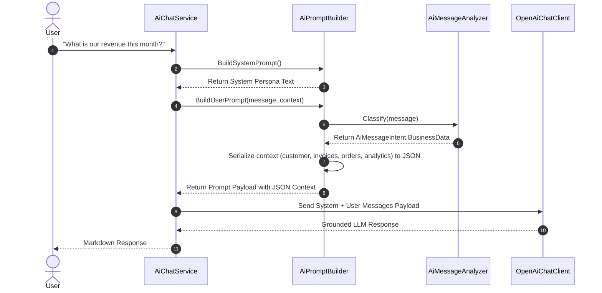

# Prompt Pipeline Guide: BusinessOS Backend

## Purpose
This document explains the Prompt Construction Pipeline in BusinessOS, covering system instructions, prompt templates, context enrichment, conversational guardrails, and anti-hallucination rules.

---

## Responsibilities
* Formulate system persona instructions (`AiPromptBuilder.BuildSystemPrompt`).
* Serialize dynamic business context data (`AiContextDto`) into JSON context payloads.
* Differentiate between conversational small talk and business analytics queries (`AiMessageAnalyzer`).
* Enforce anti-hallucination constraints ("Never invent customers, amounts, dates, or statuses").
* Format responses using markdown bullet points, currency formatting, and executive summaries.

---

## How It Works
`AiPromptBuilder` constructs clean, deterministic prompts for the LLM:

1. **System Persona Prompt**: Defines identity ("BusinessOS AI"), style rules, and anti-hallucination boundaries.
2. **Context Enrichment**: Converts current page context (`Page.Module`, `Page.Url`), user identity, customer snapshots, invoices, orders, and analytics into compact JSON blocks.
3. **Conversational Routing**: If user prompt is small talk ("hello", "good morning") and no explicit data was requested, bypasses raw data dumping and instructs the model to reply warmly.

```mermaid
graph TD
    User Prompt --> Analyzer[AiMessageAnalyzer.Classify]
    Analyzer --> Intent{Intent Type}
    
    Intent -->|Conversational & No Data Requested| SmallTalk[Build Conversational User Prompt]
    Intent -->|Business Analytics / Data Request| ContextBuild[Serialize AiContextDto to compact JSON]
    
    SmallTalk --> Combine[Combine System Prompt + User Prompt]
    ContextBuild --> Combine
    
    Combine --> LLM[OpenAiChatClient / LLM Provider]
```

---

## Execution Flow



---

## System Persona Rules (`BuildSystemPrompt`)
```
You are BusinessOS AI, a professional business assistant embedded in BusinessOS.
Answer using ONLY the business data provided in the user message context.
Never invent customers, amounts, dates, or statuses.
If the data is empty or missing, say you don't have that information yet.

Style rules:
- For greetings or small talk, reply warmly and briefly — do NOT dump raw data or JSON.
- For business questions, give clear, confident summaries in plain language with bullet points when helpful.
- Use currency formatting for money values.
- Never output raw JSON unless the user explicitly asks for JSON.
```

---

## Dependencies
* **System.Text.Json**: Compact JSON serialization (`JsonNamingPolicy.CamelCase`).
* **BusinessOS.Application.Features.AI.DTOs**: Context data models (`AiContextDto`, `AiPageContextDto`).

---

## Used By
* `AiChatService.cs`
* `AgentPlanner.cs`

---

## Calls To
* `AiMessageAnalyzer.Classify()`
* `JsonSerializer.Serialize()`

---

## Important Classes
* `AiPromptBuilder`: Builds system persona and user prompt text.
* `AiMessageAnalyzer`: Classifies query intent.

---

## Important Interfaces
* `IAiPromptBuilder`

---

## Important Methods
* `BuildSystemPrompt()`: Returns static system instruction text.
* `BuildUserPrompt(string message, AiContextDto context)`: Assembles context JSON block and question.

---

## Configuration
No external settings required; prompt rules are maintained in code to ensure system prompt immutability.

---

## Common Pitfalls
* **Context Overfill**: Serializing full domain entities with circular navigation properties causes LLM token limit exhaustion. `AiContextDto` uses lightweight DTO projections to keep payload size small.

---

## Future Improvements
* Add dynamic prompt template selection based on active agent persona (`sales_agent`, `finance_agent`, `inventory_agent`).

---

## Related Documents
* [AI-Agent.md](file:///d:/Business_OS/BusinessOS/docs/AI-Agent.md)
* [RAG.md](file:///d:/Business_OS/BusinessOS/docs/RAG.md)
