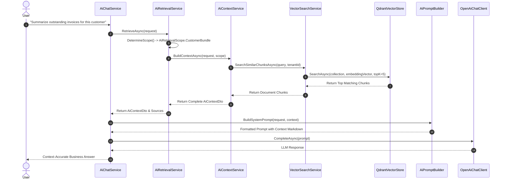

# RAG (Retrieval-Augmented Generation) Guide: BusinessOS Backend

## Purpose
This document provides a detailed breakdown of the Retrieval-Augmented Generation (RAG) pipeline in BusinessOS, explaining contextual data retrieval, vector search indexing, embedding generation, scope determination, and dynamic prompt injection.

---

## Responsibilities
* Classify incoming natural language queries to determine if contextual retrieval is required (`AiRetrievalService.DetermineScope`).
* Determine target retrieval scope (`CustomerBundle`, `OverdueInvoices`, `RevenueRanking`, `ProjectProgress`, `CurrentInvoice`, `CurrentOrder`).
* Ingest domain entities (`AiDocument`, `AiDocumentChunk`) and generate 1536-dimensional vector embeddings using OpenAI (`text-embedding-3-small`).
* Perform top-k vector similarity searches against Qdrant vector database collection.
* Assemble structured context payloads (`AiContextDto`) and pass them to `AiPromptBuilder` for LLM completion.

---

## How It Works
The RAG pipeline operates across two complementary sub-systems:

1. **Structured RAG (Context Assembly)**: Intercepts entity references based on user page context and query semantics to pull exact database snapshots (Customer stats, unpaid invoices, team tasks).
2. **Unstructured Vector RAG**: Ingests uploaded business documents and entity descriptions into `QdrantVectorStore`. Queries generate embeddings and pull semantic top-k chunks.

```mermaid
graph TD
    User Query --> ScopeResolver[AiRetrievalService.DetermineScope]
    
    ScopeResolver -->|Check Scope| Choice{Retrieval Type}
    
    Choice -->|Structured Entity Context| DB[ApplicationDbContext]
    DB --> CustomerData[Customer, Invoices, Orders Snapshot]
    
    Choice -->|Unstructured Document RAG| VectorEngine[VectorSearchService]
    VectorEngine --> EmbedGen[OpenAiEmbeddingGenerator: text-embedding-3-small]
    EmbedGen --> Qdrant[QdrantVectorStore.SearchAsync]
    Qdrant --> RelevantChunks[Top-K Semantic Document Chunks]
    
    CustomerData --> ContextAggregator[AiContextService.BuildContextAsync]
    RelevantChunks --> ContextAggregator
    
    ContextAggregator --> PromptBuilder[AiPromptBuilder]
    PromptBuilder --> LLM[OpenAiChatClient LLM Completion]
    LLM --> FinalReply[Context-Enriched Response]
```

---

## Execution Flow



---

## Retrieval Scopes (`AiRetrievalScope`)
* **`CustomerBundle`**: Fetches total revenue, credit limit, balance, active orders, and last 5 invoices for targeted customer.
* **`OverdueInvoices`**: Queries invoices where `DueDate < UtcNow` and `Status != Paid`.
* **`RevenueRanking`**: Aggregates customer invoice sums ordered by total paid revenue.
* **`ProjectProgress`**: Pulls project tasks, completion percentages, and delayed team work tasks.
* **`CurrentInvoice`**: Fetches active invoice line items, tax details, and payments.
* **`CurrentOrder`**: Fetches active order items, stock reservations, and status transitions.

---

## Document Ingestion & Chunking
1. Uploaded files (`AiDocument`) are stored in database and filesystem.
2. File content is split into overlapping chunks (`AiDocumentChunk`) of ~500 tokens with 50-token overlap.
3. `OpenAiEmbeddingGenerator` sends text chunks to OpenAI Embedding API (`text-embedding-3-small`), returning 1536-float vector arrays.
4. `QdrantVectorStore` indexes payload vectors with metadata (`TenantId`, `DocumentId`, `ChunkIndex`).

---

## Dependencies
* **OpenAI API**: `text-embedding-3-small` embedding model.
* **Qdrant.Client**: Vector search database client.
* **ApplicationDbContext**: Relational context fetcher.

---

## Used By
* `AiChatService.cs`
* `AgentPlanner.cs`
* `AiEndpoints.cs`

---

## Calls To
* `IAiContextService.BuildContextAsync()`
* `IVectorStore.SearchAsync()`
* `IOpenAiEmbeddingGenerator.GenerateEmbeddingAsync()`

---

## Important Classes
* `AiRetrievalService`: Determines query scope and fetches structured + unstructured context.
* `AiContextService`: Builds composite context DTO containing financial summaries, entities, and vector chunks.
* `VectorSearchService`: Executes semantic vector lookups.
* `QdrantVectorStore`: Qdrant gRPC database provider.

---

## Important Interfaces
* `IAiRetrievalService`
* `IAiContextService`
* `IVectorSearchService`
* `IVectorStore`

---

## Important Methods
* `AiRetrievalService.DetermineScope()`
* `AiContextService.BuildContextAsync()`
* `QdrantVectorStore.SearchAsync()`

---

## Configuration
Configured in `appsettings.json`:
```json
{
  "Qdrant": {
    "Host": "localhost",
    "Port": 6334,
    "ApiKey": "",
    "CollectionName": "businessos_knowledge"
  }
}
```

---

## Common Pitfalls
* **Tenant Cross-Contamination**: Vector queries must ALWAYS include `TenantId` payload filters in Qdrant searches to guarantee multi-tenant vector isolation.

---

## Future Improvements
* Add Hybrid Search combining vector cosine similarity with full-text BM25 keyword scoring.

---

## Related Documents
* [AI-Agent.md](file:///d:/Business_OS/BusinessOS/docs/AI-Agent.md)
* [Prompt-Pipeline.md](file:///d:/Business_OS/BusinessOS/docs/Prompt-Pipeline.md)
* [Vector-Search.md](file:///d:/Business_OS/BusinessOS/docs/Vector-Search.md)
