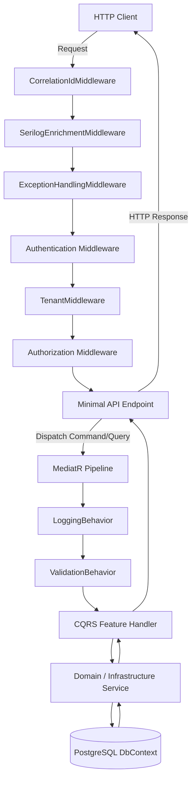

# Request Lifecycle Guide: BusinessOS Backend

## Purpose
This document details the end-to-end processing path of an incoming HTTP request in the BusinessOS API, tracing its lifecycle from network ingestion through middleware layers, MediatR pipeline behaviors, handler execution, database persistence, and response serialization.

---

## Responsibilities
* Guarantee request correlation tracking across log streams (`CorrelationIdMiddleware`).
* Resolve multi-tenant context (`TenantMiddleware`) before execution hits domain handlers.
* Enforce authentication and permission-based authorization policies.
* Intercept invalid requests prior to domain execution using `ValidationBehavior`.
* Wrap execution in structured audit logging (`LoggingBehavior`).
* Intercept uncaught exceptions and convert them to standard HTTP `ProblemDetails` responses (`ExceptionHandlingMiddleware`).

---

## How It Works
When an HTTP request strikes `BusinessOS.API`, it enters ASP.NET Core's Kestrel server and traverses a pipeline of ordered middlewares and MediatR behaviors.



---

## Execution Flow

```mermaid
sequenceDiagram
    autonumber
    actor Client
    participant Kestrel as Kestrel Server
    participant Corr as CorrelationIdMiddleware
    participant Exc as ExceptionHandlingMiddleware
    participant Auth as Auth & Tenant Middleware
    participant End as Endpoint (MapPost)
    participant Pipe as ValidationBehavior
    participant Hand as CQRS Handler
    participant DB as DbContext

    Client->>Kestrel: POST /api/invoices (Header: Authorization, X-Tenant-Id)
    Kestrel->>Corr: Assign X-Correlation-ID header
    Corr->>Exc: Enter Try/Catch wrapper
    Exc->>Auth: Authenticate JWT & Resolve TenantId
    Auth->>End: Route matched -> Extract DTO
    End->>Pipe: _mediator.Send(CreateInvoiceCommand)
    Pipe->>Pipe: Validate Command via FluentValidation
    alt Validation Failed
        Pipe-->>Exc: Throw ValidationException
        Exc-->>Client: 400 Bad Request (Validation ProblemDetails)
    else Validation Succeeded
        Pipe->>Hand: Handle(CreateInvoiceCommand)
        Hand->>DB: Add Invoice & SaveChangesAsync()
        DB-->>Hand: Saved Entity
        Hand-->>End: Result<InvoiceDto>
        End-->>Client: 201 Created (JSON Payload)
    end
```

---

## Dependencies
* **Microsoft.AspNetCore.Http**: `HttpContext`, `RequestDelegate`.
* **MediatR**: `IPipelineBehavior<TRequest, TResponse>`.
* **FluentValidation**: `IValidator<TRequest>`.
* **Serilog**: `ILogger`, `LogContext`.

---

## Used By
* Every REST API endpoint and SignalR websocket request in BusinessOS.

---

## Calls To
* `TenantContextService.SetTenant()`
* `IValidator.ValidateAsync()`
* `ApplicationDbContext.SaveChangesAsync()`

---

## Important Classes
* `CorrelationIdMiddleware`: Generates or propagates `X-Correlation-ID` header.
* `TenantMiddleware`: Extracts tenant slug or ID from request header (`X-Tenant-Id`) or host subdomain.
* `ExceptionHandlingMiddleware`: Centralized catch block mapping domain exceptions (`NotFoundException`, `ValidationException`, `UnauthorizedAccessException`) to HTTP status codes.
* `ValidationBehavior<TRequest, TResponse>`: Pre-handler pipeline validation step.
* `LoggingBehavior<TRequest, TResponse>`: Measures request execution time and logs request performance.

---

## Important Interfaces
* `ITenantContext`: Provides tenant contextual state across the scope.
* `ICurrentUserService`: Exposes current user ID and claims.
* `IPipelineBehavior<TRequest, TResponse>`: Pipeline interception interface.

---

## Important Methods
* `CorrelationIdMiddleware.InvokeAsync(HttpContext context)`: Attach correlation ID to response headers and Serilog context.
* `TenantMiddleware.InvokeAsync(HttpContext context)`: Populate `ITenantContext`.
* `ValidationBehavior.Handle(TRequest request, RequestHandlerDelegate<TResponse> next, CancellationToken ct)`: Execute FluentValidators.

---

## Configuration
Middlewares are registered in `BusinessOS.API/Program.cs` in strict sequence:
```csharp
app.UseMiddleware<CorrelationIdMiddleware>();
app.UseMiddleware<SerilogEnrichmentMiddleware>();
app.UseMiddleware<ExceptionHandlingMiddleware>();
app.UseAuthentication();
app.UseMiddleware<TenantMiddleware>();
app.UseAuthorization();
```

---

## Common Pitfalls
* **Reordering Middleware**: Placing `TenantMiddleware` before `Authentication` prevents resolving user-based tenant overrides.
* **Swallowing Exceptions in Handlers**: Handlers should let unexpected exceptions bubble up to `ExceptionHandlingMiddleware` to ensure standard `ProblemDetails` formats.

---

## Future Improvements
* Add Rate Limiting Middleware (`Microsoft.AspNetCore.RateLimiting`) per tenant tier (e.g. 100 req/min for Free tier, 1000 req/min for Enterprise tier).

---

## Related Documents
* [Middleware.md](file:///d:/Business_OS/BusinessOS/docs/Middleware.md)
* [CQRS.md](file:///d:/Business_OS/BusinessOS/docs/CQRS.md)
* [Error-Handling.md](file:///d:/Business_OS/BusinessOS/docs/Error-Handling.md)
