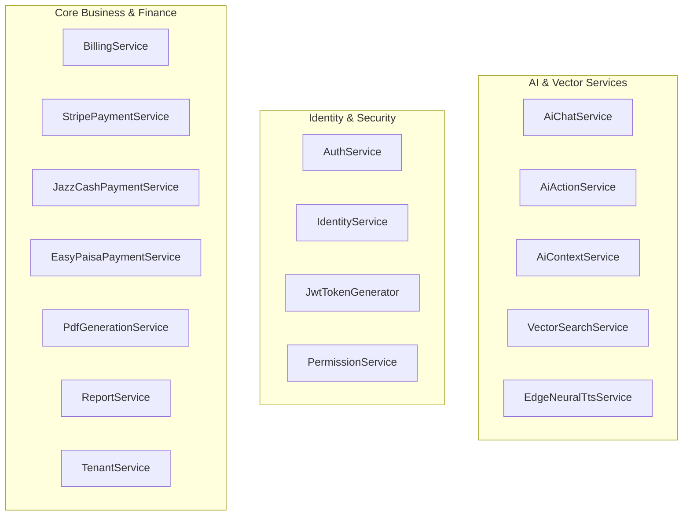
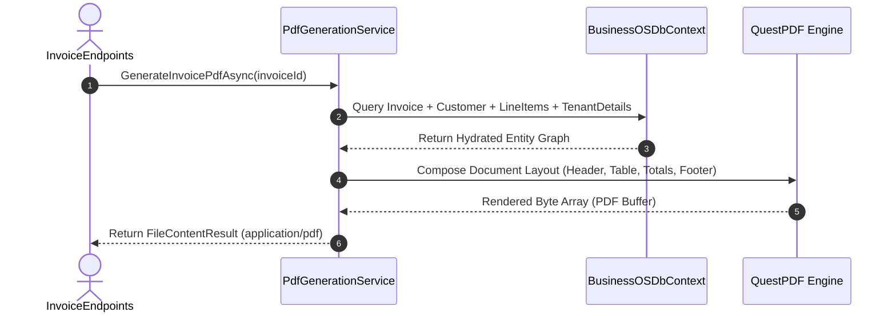

# Application & Infrastructure Services Index: BusinessOS Backend

## Purpose
This document provides a comprehensive operational dictionary of all Application and Infrastructure Services in BusinessOS, documenting their responsibilities, public/private methods, dependencies, business rules, and execution contexts.

---

## Responsibilities
* Provide modular, reusable business services across application use-cases.
* Encapsulate complex operations (Payment processing, PDF generation, Vector search, Neural speech, JWT issuance) behind clean interface abstractions.
* Ensure clear separation of concerns between domain orchestration and external API integrations.

---

## Service Catalog Matrix

---

## Detailed Service Analysis

### 1. `AiChatService`
* **File**: `BusinessOS.Infrastructure/AI/AiChatService.cs`
* **Responsibilities**: Manages multi-turn conversation sessions, context assembly via RAG, OpenAI API invocation, and response streaming.
* **Public Methods**: `ProcessMessageAsync()`, `GetConversationHistoryAsync()`, `ClearHistoryAsync()`.
* **Dependencies**: `ILlmChatClient`, `IAiContextService`, `IAiPromptBuilder`, `ApplicationDbContext`.
* **Business Rules**: Checks tenant AI token limits before invoking LLM API calls.

### 2. `QdrantVectorStore`
* **File**: `BusinessOS.Infrastructure/VectorSearch/QdrantVectorStore.cs`
* **Responsibilities**: Native gRPC client managing vector collections, point upserts, payload filter queries (`TenantId`), and similarity scoring.
* **Public Methods**: `UpsertAsync()`, `SearchAsync()`, `DeleteAsync()`, `EnsureCollectionExistsAsync()`.
* **Dependencies**: `QdrantClient`, `IOptions<QdrantOptions>`.

### 3. `BillingService`
* **File**: `BusinessOS.Infrastructure/Services/BillingService.cs`
* **Responsibilities**: Handles tenant subscriptions, billing invoice generation, payment provider webhooks, and subscription plan upgrades/downgrades.
* **Public Methods**: `SubscribeAsync()`, `CancelSubscriptionAsync()`, `ProcessWebhookAsync()`, `GetInvoicesAsync()`.
* **Dependencies**: `ApplicationDbContext`, `ITenantService`, `IPaymentProviderFactory`.

### 4. `PdfGenerationService`
* **File**: `BusinessOS.Infrastructure/Services/PdfGenerationService.cs`
* **Responsibilities**: Generates pixel-perfect PDF documents for customer invoices, quotations, purchase orders, and inventory reports using QuestPDF and HTML rendering.
* **Public Methods**: `GenerateInvoicePdfAsync()`, `GenerateQuotationPdfAsync()`, `GenerateInventoryReportPdfAsync()`.
* **Dependencies**: `ApplicationDbContext`, `ITenantContext`.

### 5. `EdgeNeuralTtsService`
* **File**: `BusinessOS.Infrastructure/AI/Agents/EdgeNeuralTtsService.cs`
* **Responsibilities**: Converts AI agent responses into natural neural audio speech streams via Microsoft Edge Neural TTS API (`en-US-AriaNeural`, `en-US-GuyNeural`, etc.).
* **Public Methods**: `SynthesizeSpeechAsync()`.
* **Dependencies**: `HttpClient`, `ILogger`.

---

## Execution Flow

---

## Dependencies
* Services implement application interfaces located in `BusinessOS.Application/Common/Interfaces` or feature-specific service folders.

---

## Used By
* MediatR Command and Query Handlers in `BusinessOS.Application`.
* Minimal API Endpoints in `BusinessOS.API`.

---

## Common Pitfalls
* **Direct HttpClient Instantiation**: Services must use `IHttpClientFactory` rather than `new HttpClient()` to avoid socket exhaustion.

---

## Future Improvements
* Introduce resilience policies (Retry, Circuit Breaker, Timeout) via `Polly` for all external payment gateway and LLM HTTP clients.

---

## Related Documents
* [Architecture.md](file:///d:/Business_OS/BusinessOS/docs/Architecture.md)
* [Dependency-Injection.md](file:///d:/Business_OS/BusinessOS/docs/Dependency-Injection.md)
