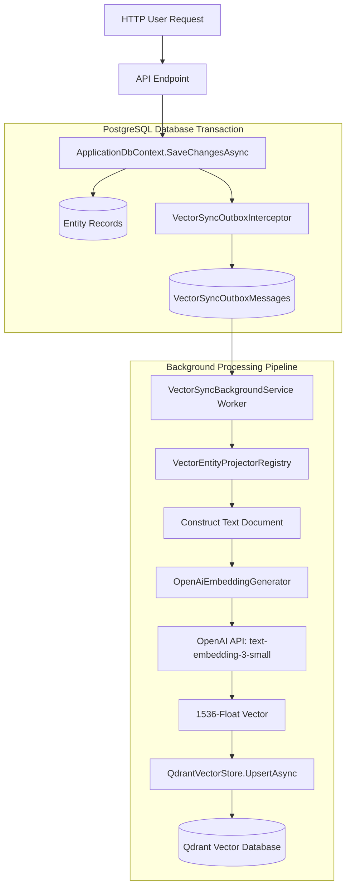
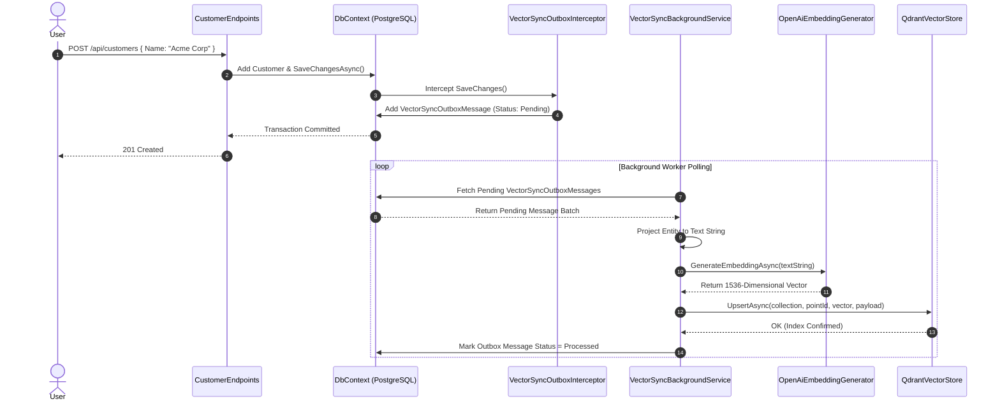

# Vector Search & Outbox Sync Guide: BusinessOS Backend

## Purpose
This document provides an in-depth technical analysis of the Vector Search and Outbox Synchronization Engine in BusinessOS, explaining Qdrant vector database storage, outbox transaction pattern, background worker processing, entity projectors, and embedding generation.

---

## Responsibilities
* Capture entity changes (Insert, Update, Delete) transactionally using `VectorSyncOutboxInterceptor`.
* Write outbox messages (`VectorSyncOutboxMessage`) to PostgreSQL inside the active EF Core transaction.
* Asynchronously poll outbox records using `VectorSyncBackgroundService`.
* Project domain entities into searchable vector documents via `VectorEntityProjectorRegistry`.
* Generate 1536-dimensional float vector embeddings via `OpenAiEmbeddingGenerator` (`text-embedding-3-small`).
* Perform cosine similarity vector lookups in `QdrantVectorStore`.

---

## How It Works

### Outbox Vector Synchronization Architecture
Rather than executing synchronous vector database HTTP/gRPC calls during user HTTP requests, BusinessOS employs an **Outbox Transactional Pattern**:

1. When a user creates/updates an entity (e.g. `Customer`, `Product`, `Invoice`), `VectorSyncOutboxInterceptor` intercepts the `DbContext.SaveChangesAsync()` call.
2. An outbox entry (`VectorSyncOutboxMessage`) is added to PostgreSQL in the **same database transaction**.
3. `VectorSyncBackgroundService` polls pending outbox messages in background batches.
4. The background worker passes entities to `VectorEntityProjectorRegistry`, generates embeddings via `OpenAiEmbeddingGenerator`, and calls `QdrantVectorStore.UpsertAsync()`.
5. Upon successful Qdrant index confirmation, outbox status is updated to `VectorSyncStatus.Processed`.



---

## Execution Flow



---

## Key Components

### 1. `QdrantVectorStore`
* **File**: `BusinessOS.Infrastructure/VectorSearch/QdrantVectorStore.cs`
* **Purpose**: Native gRPC client wrapping `Qdrant.Client`. Manages collection initialization, point upserts, payload filter queries (`TenantId`), point deletions, and similarity scoring.

### 2. `VectorSyncOutboxInterceptor`
* **File**: `BusinessOS.Infrastructure/VectorSearch/VectorSyncOutboxInterceptor.cs`
* **Purpose**: EF Core `SaveChangesInterceptor` detecting entity mutations for tracked entities (`Customer`, `Product`, `Invoice`, `Project`, `WorkTask`).

### 3. `VectorSyncBackgroundService`
* **File**: `BusinessOS.Infrastructure/VectorSearch/VectorSyncBackgroundService.cs`
* **Purpose**: `IHostedService` worker process polling outbox tables every N seconds (`VectorSyncOptions.PollIntervalSeconds`). Implements exponential retry backoff (`MaxRetryAttempts`).

### 4. `VectorEntityProjectorRegistry`
* **File**: `BusinessOS.Infrastructure/VectorSearch/VectorEntityProjectorRegistry.cs`
* **Purpose**: Registry mapping domain entity types to text projection templates. Converts structured objects into rich natural language strings suitable for embedding.

---

## Dependencies
* **Qdrant.Client**: Official gRPC vector database client SDK.
* **OpenAI SDK**: API client for `text-embedding-3-small`.
* **Microsoft.EntityFrameworkCore**: `SaveChangesInterceptor`.

---

## Used By
* `AiRetrievalService.cs`
* `VectorSearchService.cs`
* `ApplicationDbContext`

---

## Calls To
* `QdrantClient.UpsertAsync()`
* `QdrantClient.SearchAsync()`
* `OpenAI.Embeddings.GenerateEmbeddingAsync()`

---

## Important Classes
* `QdrantVectorStore`
* `VectorSyncOutboxInterceptor`
* `VectorSyncBackgroundService`
* `VectorEntityProjectorRegistry`
* `OpenAiEmbeddingGenerator`

---

## Important Interfaces
* `IVectorStore`
* `IEmbeddingGenerator`
* `IVectorEntityProjectorRegistry`

---

## Important Methods
* `VectorSyncOutboxInterceptor.SavingChangesAsync()`
* `VectorSyncBackgroundService.ProcessBatchAsync()`
* `QdrantVectorStore.SearchAsync()`

---

## Configuration
Configured in `appsettings.json`:
```json
{
  "Qdrant": {
    "Host": "localhost",
    "Port": 6334,
    "ApiKey": "",
    "CollectionName": "businessos_knowledge"
  },
  "VectorSync": {
    "PollIntervalSeconds": 5,
    "BatchSize": 50,
    "MaxRetryAttempts": 3
  }
}
```

---

## Common Pitfalls
* **Gaps in Vector Sync**: If Qdrant is offline, outbox messages transition to `Failed` after maximum retries. `VectorBackfillHostedService` provides bulk backfill capabilities to re-queue failed messages.

---

## Future Improvements
* Add vector quantization (Scalar / Product Quantization) in Qdrant to reduce memory footprint for multi-million vector collections.

---

## Related Documents
* [RAG.md](file:///d:/Business_OS/BusinessOS/docs/RAG.md)
* [Database.md](file:///d:/Business_OS/BusinessOS/docs/Database.md)
