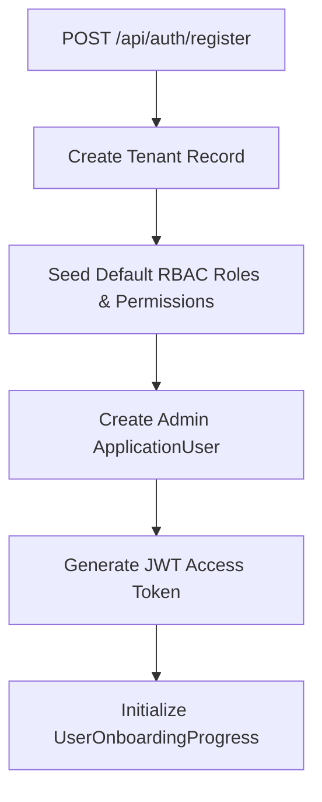
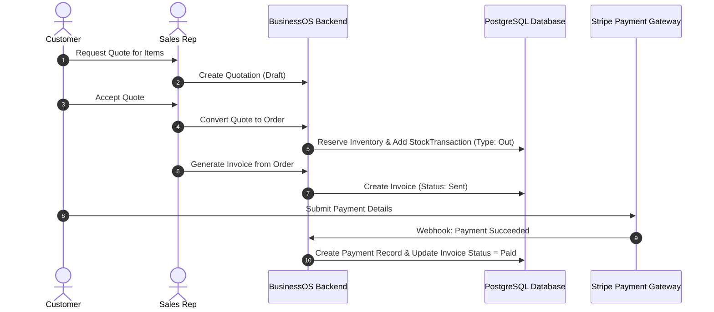
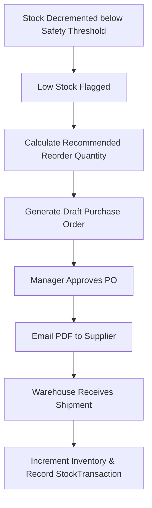

# Core Business Domain Workflows Guide: BusinessOS Backend

## Purpose
This document details the end-to-end operational domain workflows implemented within BusinessOS, tracing business lifecycle events across multi-tenancy onboarding, sales order processing, invoicing, inventory procurement, and AI copilot execution.

---

## Responsibilities
* Document state transitions, business validation rules, and domain entity mutations across business operations.
* Map multi-component workflows spanning API endpoints, MediatR handlers, background workers, PDF generators, and payment providers.

---

## Workflow Catalogs

### Workflow 1: Tenant Onboarding & Company Setup
1. User registers via `POST /api/auth/register`.
2. System initializes `Tenant` record, provisions default `TenantSettings`, default RBAC `Role`s (`Admin`, `Manager`, `Employee`), and seeds permission matrices.
3. User completes onboarding wizard steps (`UserOnboardingProgress`), setting business currency, logo, and invoice numbering prefix.

---

### Workflow 2: Sales Order to Invoice Settlement
1. Customer requests quotation -> Sales representative emits `Quotation`.
2. Customer accepts -> System converts `Quotation` into `Order` & `OrderItem` records.
3. System checks `Inventory.QuantityOnHand`. Decrements stock, logs `StockTransaction`.
4. System emits `Invoice` (Status: `Sent`).
5. Customer submits payment via Stripe / JazzCash -> `Payment` record created, `Invoice.Status` updated to `Paid`.

---

### Workflow 3: Automated Reordering & Inventory Replenishment
1. Sales activity drops `Inventory.QuantityOnHand` below `ReorderLevel`.
2. Background stock analyzer (`GetLowStock` tool / `InventoryService`) triggers reorder alert.
3. System generates draft `Purchase` order addressed to `Supplier`.
4. Manager approves PO -> System transmits PO PDF to supplier via email (`EmailNotificationService`).
5. Supplier delivers stock -> Warehouse receives items -> System increments `Inventory.QuantityOnHand` and logs `StockTransaction` (Type: In).

---

### Workflow 4: Autonomous AI Copilot Business Action
1. User types in chat: *"Find top 3 overdue customers and email them payment reminders"*.
2. AI Agent classifies intent (`AiCopilotIntent.Workflow`).
3. `AgentPlanner` generates execution steps:
   - Step 1: `GetOverdueInvoices`
   - Step 2: `GetCustomerSummary`
   - Step 3: `SendEmailNotification`
4. Agent executes tools via `AiActionService`.
5. AI Agent reports completion summary and emits neural voice audio response.

---

## Related Documents
* [Architecture.md](file:///d:/Business_OS/BusinessOS/docs/Architecture.md)
* [AI-Agent.md](file:///d:/Business_OS/BusinessOS/docs/AI-Agent.md)
* [Controllers.md](file:///d:/Business_OS/BusinessOS/docs/Controllers.md)
